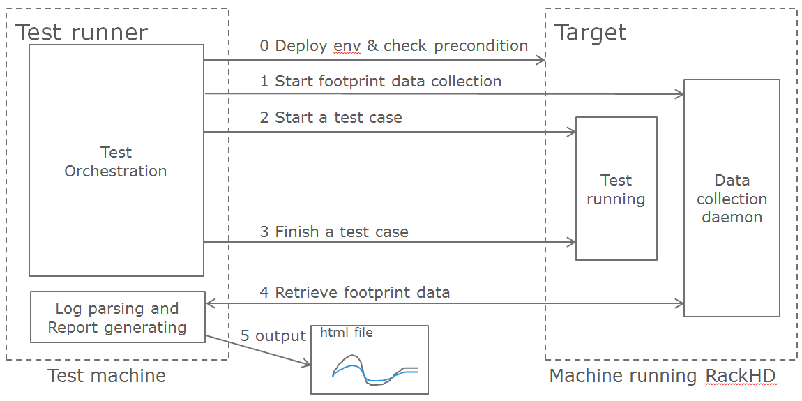

RackHD Debugging Guide
-----------------------

Discovery with a Default Workflow
~~~~~~~~~~~~~~~~~~~~~~~~~~~~~~~~~~~~~

Sequence Diagram for the Discovery Workflow

.. image:: https://www.websequencediagrams.com/cgi-bin/cdraw?lz=dGl0bGUgRGVmYXVsdCBEaXNjb3ZlcnkgV29ya2Zsb3cKU2VydmVyLT5SYWNrSEQ6IERIQ1AgZnJvbSBQWEUobmljIG9yIEJJT1MpCgAdBi0-AC0GOiBJU0MAKQZyZXNwb25zZSB3aXRoIElQCm5vdGUgb3ZlciAAUAcKICAgIElmIHRoZSBub2RlIGlzIGFscmVhZHkgImtub3duIiwAHwVpdCB3aWxsIG9ubHkAUQdkIGkANAVyZSdzIGFuIGFjdGl2ZSB3AIE6CCAgICB0aGF0J3MgYmVlbiBpbnZva2VkIHJlbGF0ZWQgdG8AbgkKZW5kIG5vdGUAgTsRREhDUC1wcm94AG4IAIFGCGJvb3RmaWxlAIIYEVJlcXVlc3QgdG8gZG93bmxvYWQAJAkgdmlhIFRGVFAAgiMRVEZUUCBzZW5kcyByADsGZWQgAC4FKG1vbm9yYWlsLmlweGUpAII5CwCCaQcAgj8FAIMpBiBsb2FkcyAAJQ0Agl4FYW5kIGluaXRpYXRlcyBvbgCBOgVsb2FkZXIAgXIKAINjEElQWEUgc2NyaXB0AIENCHMgd2hhAIFVBwCECAYAhBoGIChodHRwAIERDACDVQwAHQdsb29rcyB1cCBJUCBhZGRyZXNzIG9mIEhUVFAAgW0IAIRcBmkAbgt0byBmaW5kAIQYCnZpYSBpdHMgbWFjLQA_By4AhEIFMSkAhCogAINnXwCBAQYyAHcQbid0IACFRgUAdgpjcmVhdGUgYQCFJAkgKGQAhwQHaXMAhggFABAJJ0dyYXBoLlNrdS4Ahx0JJykAg0wJAIYDCACGXQVhbgCCKxAAg2wIAIYEBS4AhU0aAIJmDCgAg14FAINRB2NhbGxzIGEgUHJvZmlsZSkgKHZpYSAAg10QAIR-DACDMQwAh3MFUmFuY2hlck9TIHZtbGludXoAh0sHbml0cmQAhRUFY2xvdWQtY29uZmlnAIRCCACEfRkAhBgFAIUGCXN0YXRpYwCGJAYtAIhCBQBeESBrZXJuZWwAiRYRABcSAIU-BwBGLFJhAIFVBwCBSQYAShsAgWkHAIYYEQCHLRl0aGUAgToJAIc4CHJkAIoJBmFuZCB0cmFuc2ZlcnMgY29udHJvbCAoYm9vdHMAgmcKAIIrGwCDCwoAh1EJAIJ5DQCBTwsAgxIMAIIqGwCDOQwAgjIXAIQACgCJIgZkAIxuCWRvY2tlciBpbWFnZQCMYAYAjHoGAIlXF3RoZQAyC2NvbnRhaW5lciBpcyBzZQCKdgUAij4HAIl0CWxhdW5jaCBhIE5vZGVKUyB0YXNrIHJ1bm5uAIlmHACJbQl0aGUAi20Fc3RyYXAuanMgdGVtcGxhAIweEwAZDWZpbGxlZCBvdQCGBAd2YWx1ZXMgc3BlY2lmaWMAjHcMIGJhc2VkIG9uIGEAiiQFdXAAi1MXcnVucwArBwCBBgsAiywaAIEuCSBhc2tzIGZvcgCBeAVzAIdhB3Nob3VsZCBJIGRvPwCPORJkYXRhIHBhY2tldCBvZgAxCACHYyAAkDwTICAgIHBhc3NlcwCOEQUAfAd0bwCIBAd0ZXJyb2dhdGUgaGFyZHdhcgCPCAtsb29wAIEyBWVhY2ggVGFzawCMbgwAjXMLAJEjCm91dHB1AIEpCQplbmQAkGoRAJB1BQBIBQAmB3N0b3JlZCBhcyBjYXRhbG9ncyBpbgCNVwgAi1UZSWYAjXoIaQCHAwVmaWd1cmUAiwkHU0tVIGRlZgCOdAVvbnMAkUEJcHJvY2UAggcFdGhlc2UAZwp0byBkZXRlcm1pbmUAkg8FU0tVAF8JAJFiCQBTBQCEOwkAjDoJAGUFZWQsAIgGCQCBDAZ0aW51AJFmCGF0AI4lBlQAhjMNAIx8CQCNDw1uIGVuY2xvc3VyAIUREHRoAIEqCQCEHAUAMiJhbHNvAI1tCElQTUkgcG9sbGVyAIUHBwCTdQcAk2IHZiByZWxldmVudCBpbmZvcm1hdGlvbiBjYW4gYmUgZm91AJFGBQB5DABZJ2dlbmVyAI4HBWFnAGYTAIZ3CXVzZXItAIJGByB0YWdnaW5nIHJ1bGVzAI42CwCGGU1Ob3RoaW5nIG1vcmUsIHRoYW5rcyAtIHBsZWFzZSByZWJvb3QAjm4L&s=modern-blue

The diagram is made with `WebSequenceDiagrams`_.

To see if the DHCP request was received by ISC DHCP, look in `/var/log/syslog` of the RackHD host. `grep DHCP /var/log/syslog` works reasonably well - you're looking for a sequence like this::

    Jan  8 15:43:43 rackhd-demo dhclient: DHCPDISCOVER on eth0 to 255.255.255.255 port 67 interval 3 (xid=0x5b3b9260)
    Jan  8 15:43:43 rackhd-demo dhclient: DHCPREQUEST of 10.0.2.15 on eth0 to 255.255.255.255 port 67 (xid=0x60923b5b)
    Jan  8 15:43:43 rackhd-demo dhclient: DHCPOFFER of 10.0.2.15 from 10.0.2.2
    Jan  8 15:43:43 rackhd-demo dhclient: DHCPACK of 10.0.2.15 from 10.0.2.2

You should also see the DHCP proxy return the bootfile. In the DHCP-proxy logs, look for lines with `DHCP.messageHandler`::

    S 2016-01-08T19:31:43.268Z [on-dhcp-proxy] [DHCP.messageHandler] [Server] Unknown node 08:00:27:f3:9f:2e. Sending down default bootfile.

And immediately thereafter, you should see the server request the file from TFTP::

    S 2016-01-08T19:31:43.352Z [on-tftp] [Tftp.Server] [Server] tftp: 67.300 monorail.ipxe

.. _WebSequenceDiagrams: https://www.websequencediagrams.com

Default discovery workflow
~~~~~~~~~~~~~~~~~~~~~~~~~~~

.. code::

    title Default Discovery Workflow
    Server->RackHD: DHCP from PXE(nic or BIOS)
    RackHD->Server: ISC DHCP response with IP
    note over RackHD:
        If the node is already "known",
        it will only respond if there's an active workflow
        that's been invoked related to the node
    end note
    RackHD->Server: DHCP-proxy response with bootfile
    Server->RackHD: Request to download bootfile via TFTP
    RackHD->Server: TFTP sends requested file (monorail.ipxe)
    note over Server:
        Server loads monorail.ipxe
        and initiates on bootloader
    end note
    Server->RackHD: IPXE script requests what to do from RackHD (http)
    note over RackHD:
        RackHD looks up IP address of HTTP request from iPXE script to find the node via its mac-address.
        1) If the node is already "known", it will only respond if there's an active workflow
        that's been invoked related to the node.
        2) If the node isn't known, it will create a workflow (default is the workflow 'Graph.Sku.Discovery')
        and respond with an iPXE script to initiate that.
    end note
    RackHD->Server: iPXE script (what RackHD calls a Profile) (via http)
    note over Server:
        iPXE script with RancherOS vmlinuz,
        initrd and cloud-config (http)
    end note
    Server->RackHD: iPXE requests static file - the RancherOS vmlinuz kernel
    RackHD->Server: RancherOS vmlinuz (http)
    Server->RackHD: iPXE requests static file - RacherOS initrd
    RackHD->Server: RancherOS initrd (http)
    note over Server:
        Server loads the vmlinuz and initrd,
        and transfers control (boots RancherOS)
    end note
    Server->RackHD: RancherOS requests cloud-config - RacherOS cloud-config
    RackHD->Server: RancherOS cloud-config(http)
    Server->RackHD: RancherOS loads discovery docker image from Server
    note over Server:
        the discovery container is set to request
        and launch a NodeJS task runnner
    end note
    Server->RackHD: requests the bootstrap.js template
    RackHD->Server: bootstrap.js filled out with values specific to the node based on a lookup
    note over Server:
        runs node bootstrap.js
    end note
    Server->RackHD: bootstrap asks for tasks (what should I do?)
    RackHD->Server: data packet of tasks (via http)
    note over Server:
        Discovery Workflow
        passes down tasks to
        interrogate hardware
    end note
    loop for each Task from RackHD
        Server->RackHD: output of task
    end
    note over RackHD
        Task output stored as catalogs in RackHD related to the node.
        If RackHD is configured with SKU definitions,
        it processes these catalogs to determine the SKU.
        If there's a SKU specific workflow defined, control is continued to that.
        The discovery workflow will create an enclosure node based on the catalog data.
        The discovery workflow will also create IPMI pollers for the node,
        if relevent information can be found in the catalog.
        The discovery workflow will also generate tag for the node,
        based on user-defined tagging rules.
    end note
    Server->RackHD: bootstrap asks for tasks (what should I do?)
    RackHD->Server: Nothing more, thanks - please reboot (via http)

Footprint Benchmark Test
~~~~~~~~~~~~~~~~~~~~

Footprint benchmark test collects system data when running poller (15min), node discovery and CentOS bootstrap test cases.
It can also run independently from any test cases, allowing users to measure footprint about any operations they carry out.
The data includes CPU, memory, disk and network consumption of every process in RackHD, as well as RabbitMQ and MongoDB processes.
The result is presented as HTML files.
For more details, please check the wiki page `proposal-footprint-benchmarks`_.

.. _proposal-footprint-benchmarks: https://github.com/RackHD/RackHD/wiki/proposal-footprint-benchmarks

How It Works
^^^^^^^^^^^^^^^^^^^^^^^^^^^^^^^^^^^^^^^^^^^
Footprint benchmark test is integrated into RackHD test framework.
It can be executed as long as the machine running the test can access the RackHD API and manipulate the RackHD machine via SSH.

Prerequisites
^^^^^^^^^^^^^^^^^^^^^^^^^^^^^^^^^^^^^^^^^^^
- The machine running RackHD can use apt-get to install packages, which means it must have accessible sources.list.
- In RackHD, compute nodes have been discovered, and pollers are running.
- No external AMQP queue with the name "graph.finished" is subscribed to RackHD, since the benchmark test uses this queue.
- Make sure the AMQP port in RackHD machine can be accessed by the test machine.
  If RackHD is not running in Vagrant, user can tunnel the port using the following command in RackHD machine.

.. code::

    sudo socat -d -d TCP4-LISTEN:55672,reuseaddr,fork TCP4:localhost:5672

How to Run
^^^^^^^^^^^^^^^^^^^^^^^^^^^^^^^^^^^^^^^^^^^
Clone the test repo from GitHub

.. code::

    git clone https://github.com/RackHD/RackHD.git

Enter test directory and install required modules in virtual env

.. code::

    cd RackHD/test
    virtualenv .venv
    source .venv/bin/activate
    pip install -r requirements.txt

Configure RackHD related parameters in config.ini

.. code::

    vim config/config.ini

Run the test.
The first time user kicks off the test, he/she will be asked to input sudoer's username and password of localhost.

.. code::

    python benchmark.py

If user would like to run only one of the three benchmark cases, the following command can be used

.. code::

    python benchmark.py --group=poller|discovery|bootstrap

Run footprint data collection independently

.. code::

    python benchmark.py --start|stop

To get the directory of the latest log file

.. code::

    python benchmark.py --getdir

After the test finishes, the result is in ~/benchmark, and arranged by the timestamp and case name.
Please use the command below to open Chrome

.. code::

    chrome.exe --user-data-dir="C:/Chrome dev session" --allow-file-access-from-files

In the "report" directory of the case, drag the summary.html into Chrome.
The footprint data and graph will be shown in the page,
and user can also compare it with previous runs by selecting another case from the drop-down menu in the page.

Logged warnings FAQ
~~~~~~~~~~~~~~~~~~~~

*Question*:

I'm seeing this warning appear in the logs but it all seems to be working. What's happening?

.. code::

    W 2016-01-29T21:06:22.756Z [on-tftp] [Tftp.Server] [Server] Tftp error
     -> /lib/server.js:57
    file:          monorail.ipxe
    remoteAddress: 172.31.128.5
    remotePort:    2070
    W 2016-01-29T21:12:43.783Z [on-tftp] [Tftp.Server] [Server] Tftp error
     -> /lib/server.js:57
    file:          monorail.ipxe
    remoteAddress: 172.31.128.5
    remotePort:    2070

*Answer*:

What I learned (so I may be wrong here, but think it’s accurate) is that during the boot loading/PXE process the NICs will attempt
to interact with TFTP in such a way that the first request almost always fails - it’s how
the C code in those nics is negotiating for talking with TFTP. So you’ll frequently see those errors in the logs,
and then immediately also see the same file downloading on the second request from the nic (or host) doing the
bootloading.

*Question*:

When we're boostraping a node (or running a workflow against a node in general) with a NUC, we sometimes see these
extended messages on the server's console reading `Link......  down`, and depending on the network configuration
can see failures for the node to bootstrap and respond to PXE.

*Answer*:

The link down is a pernicious problem for PXE booting in general, and a part of the game that’s buried into how
switches react and bring up and down ports. We’ve generally encouraged settings like “portfast” which more
agressively bring up links that are going down and coming back up with a power cycle. In the NUCs you’re using,
you’ll see that extensively, but it happens on all networks. If you have spanning-tree enabled, some things
like that - it’ll expand the time. There’s only so much we can do to work around it, but fundamentally it means
that while the relevant computer things things are “UP and OK” and has started a TFTP/PXE boot process, the
switch hasn’t brought the NIC link up. So we added an explicit sleep in there in the monorail.ipxe to extend
'the time to let networks converge so that the process has a better chance of succeeding.
