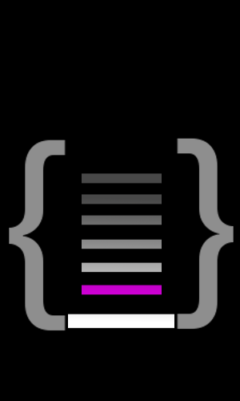

.. RackHD documentation master file, created by
   sphinx-quickstart on Sat Aug 29 13:07:25 2015.
   You can adapt this file completely to your liking, but it should at least
   contain the root `toctree` directive.

|

RackHD™
==========

**VIDEO:** `Introduction to RackHD`_

.. _Introduction to RackHD: https://www.youtube.com/embed/cCiXtROSt8U

RackHD is a technology stack up created for enabling hardware
management and orchestration, to provide cohesive APIs to enabled automated infrastructure.
In a Converged Infrastructure Platform (CIP) architecture, RackHD software provides hardware
management and orchestration (M&O). It serves as an abstraction layer between other M&O layers
and the underlying physical hardware. Developers can use the RackHD APIs as a component in a
larger orchestration system or to create a user interface for managing hardware services
regardless of the underlying hardware in place.

The project is a collection of libraries and applications housed at https://github.com/RackHD/
and documentation hosted at http://rackhd.readthedocs.org. The code for RackHD is a combination
of Javascript/Node.js and C, available under the Apache 2.0 license (or
compatible sublicences for library dependencies).

Contents
---------

.. toctree::
   :maxdepth: 1
   :numbered:

   introduction
   software_architecture
   how_it_works
   repositories
   getting_started
   contributing
   packaging_and_deployment
   devguide/index
   rackhd/index

RackHD is a Trademark of EMC Corporation.
