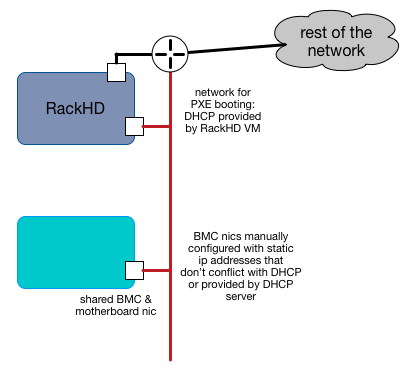
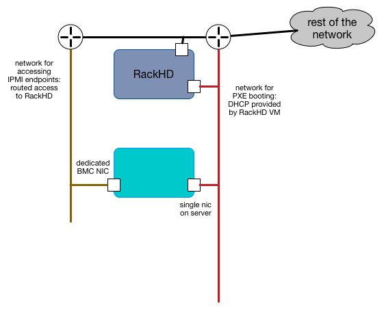
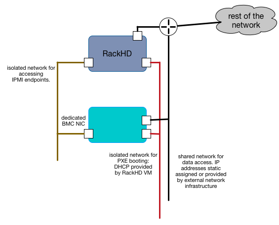

Packaging and Deployment
=======================================

RackHD can use a number of different mechanisms to coordinate and control
bare metal hardware, and in the most common cases, a deployment is working with
at least two networks, connected on different network interface cards, to the
RackHD instance.

RackHD can be configured to work with a single network, or several more networks,
depending on the needs of the installation. The key elements to designing a RackHD
installation are:

- understanding what network `security constraints`_ you are using
- understanding the `hardware controls`_ you're managing and how it can be configured
- understanding where and how `IP address management`_ is to be handled in each of the networks
  that the first two items mandate.

.. image:: ../_static/vagrant_setup.jpg
   :height: 200
   :align: right

At a minimum, RackHD expects a "southbound" network, where it is interacting with
the machines it is PXE booting a network provided with DHCP, TFTP, and HTTP and
a "northbound" network where RackHD exposes the APIs for automation and interaction.
This basic setup was created to allow and encourage separation of traffic for
PXE booting nodes and API controls. The example setup in :doc:`getting_started`
shows a minimal configuration.

Security Constraints
----------------------

RackHD as a technology is configured to control and automate hardware, which implies
a number of natural security concerns. As a service, it provides an API control
endpoint, which in turn uses protocols on networks relevant to the hardware it's
managing. One of the most common of those protocols is `IPMI`_, which has
`known security flaws`_, but is used because it's one of the most common mechanisms to
control datacenter servers.

A relatively common requirement in datacenters is that networks used for IPMI traffic
are isolated from other networks, to limit the vectors by which IPMI endpoints
could be attacked. When RackHD is using IPMI, it simply needs to have L3 (routed IP)
network traffic to the relevant endpoints in order for the workflow engine and
various controls to operate.

Access to IPMI endpoints on hardware can be separated off onto it's own network, or
combined with other networks. It is generally considered best practice to separate
this network entirely, or constrain it to highly controlled networks where access
is strictly limited.

.. _IPMI: https://en.wikipedia.org/wiki/Intelligent_Platform_Management_Interface
.. _known security flaws: https://community.rapid7.com/community/metasploit/blog/2013/07/02/a-penetration-testers-guide-to-ipmi

Hardware Controls
------------------

.. sidebar:: KCS and controlling the BMC

    Most Intel servers with BMCs include a "KCS" (Keyboard Controller Style)
    communications channel between the motherboard and the BMC. This
    allows communications between the motherboard and the BMC, where the
    software running on the main computer can interrogate and configure the BMC.

    Software tools such a IPMItool on Linux can leverage this interface, which
    shows up as a kernel device.

    RackHD is configured to use and leverage this interface by default to
    interrogate the BMC and provide information about it's settings to RackHD.
    It can also be used by workflows set values for the BMC. If the server you
    are working with does not have a BMC or does not have a KCS channel (as is
    the case with a virtual machine), then you will often see an error message
    on the console of the managed server:

    .. code::

        insmod: ERROR: could not load module /opt/drivers/ipmi_msghandler.ks: No such file or directory

    when running the default RackHD discovery through the microkernel.

RackHD manages hardware generally using at least one network interface. Network
switches typically have an administrator network interface, and Smart PDUs that
can be managed by RackHD have a administrative gateway.

Compute servers have the most varied and complex setup, with data center servers often
leveraging a BMC (Baseboard Management Controller). A BMC is a separate embedded
computer monitoring and controlling a larger computer. The
protocol used most commonly to communicate to a BMC is `IPMI`_, the details of which
can matter significantly.

Desktop class machines (and many laptops) often do not have BMCs,
although some Intel desktops may have an alternative technology: `AMT`_ which provides
some similiar mechanisms.

You can view a detailed diagram of the components inside a BMC at `IPMI Basics`_,
although every hardware vendor is slighty different in how they configure their servers.
The primary difference for most Intel-based server vendors is how the BMC network
interface is exposed. There are two options that you will commonly see:

* LOM : Lights out Management
    The BMC has has a dedicated network interface to the BMC
* SOM : "Shared on motherboard"
    The network interface to the BMC shares a network interface with the motherboard.
    In these cases, the same physical plug is backed by two internal network interfaces
    (each with its own hardware address).

If you're working with a server with a network interface shared by the motherboard and BMC,
then separating the networks that provide IPMI access and the networks that the server
will use during operation may be significantly challenging.

The BMC provides a lot of information about the computer, but not everything.
Frequently devices such as additional NIC cards, RAID array controllers, or
other devices attached to internal PCI busses aren't accessible or known about
from the BMC. This is why RackHD's default discovery mechanism operates by
:ref:`discovery-ref-label`, which loads an OS into RAM on the server and uses that
OS to interrogate the hardware.

.. _IPMI Basics: https://www.thomas-krenn.com/en/wiki/IPMI_Basics
.. _AMT: https://en.wikipedia.org/wiki/Intel_Active_Management_Technology

IP Address Management
----------------------

With multiple networks in use with RackHD, how machines are getting IP addresses
and what systems are repsonsible for providing those IP addresses another
critical concern. Running DHCP, which RackHD integrates with tightly to enable
PXE booting of hosts, much be done carefully and there should only ever be a
single DHCP server running on a given layer-2 network. Many existing systems
will often already have DHCP servers operational or a part of their environment,
or may mandate that IP addresses are set statically or provided via a static
configuration.

RackHD can be configured without a local DHCP instance, although DHCP is a
required component for PXE booting a host. If DHCP is provided externally,
then RackHD only needs to provide the `on-dhcp-proxy` process, which will need
to be on the same network as the DHCP server, and leverages the DHCP protocols
capability to separate out the service providing the TFTP boot information
from the service providing IP address (and other) configuration details for
hosts.

RackHD Network Access Requirements
------------------------------------

- DHCP-proxy
    The DHCP proxy service for RackHD needs to be on the same Layer 2 (broadcast)
    network as DHCP to provide PXE capabilities to machines PXE booting on that
    network.

- TFTP, HTTP
    The PXE network also needs to be configured to expose the `south-bound` HTTP
    API interfaces from on-http and the on-tftp service to support RackHD PXE
    booting hosts by providing the bootloaders, and responding to requests for
    files and custom templates or scripts that coordinate with RackHD's workflow
    engine.

- IPMI, HTTP/Redfish, SNMP
    Layer 3 (routed IP) access to the out of band network - the network used to
    communicate with server BMCs, SmartPDU management gateways, or Network switch
    administrative network interfaces.

Possible Configurations
--------------------------------

In an environment where the hardware you're managing doesn't have additional
network interfaces, and the BMC shares the motherboard physical network
interface, the configuration will be fairly limited.

In this example, RackHD is providing DHCP to a network which is connected
through a layer3 switch or router to the rest of the network. RackHD's
DHCP server can provide IP addresses to the motherboard NICs as the PXE
boot, and may also provide IP addresses to the BMCs if they are configured
to use DHCP.

If the compute servers are not configured to use DHCP in this setup, then
the BMC IP addresses must be statically set/assigned and carefully managed
so as to not overlap with the DHCP range that RackHD's DHCP services are
providing.

.. container:: clearer

   .. image :: ../_static/invisible.png

----------

In this example, the servers have a dedicated "lights out" network interface,
which is on a separate network and RackHD can access it via one of its interfaces.
RackHD is still providing DHCP to the servers for PXE booting on the motherboard,
but the IP addresses of the BMCs can be completely indepdent in how they are
provided.

This example, or a variation on it, is how you might configure a RackHD deployment
in a dedicated data center where the same people responsible for running RackHD
are responsible for the IP addresses and general datacenter infrastructure. In
general, this kind of configuration is what you might do with shared
responsibilities and close coordination between network configurations within
and external to RackHD

.. container:: clearer

   .. image :: ../_static/invisible.png

----------

In this example, all the networks are isolated and separate, and in this case
isolated to the instance of RackHD as well. RackHD may be multiple network
interfaces assigned to it with various network configurations. The BMC network
can be set to use a DHCP or statically assigned IP addresses - as long as the
network routing is clear and consistent to RackHD. The servers also have
multiple network interface cards attached to the motherboard, each of which
can be on separate networks, or they can be used in combined configurations.

This example highlights how RackHD might be configured if it was being used to
independently manage a rack of gear, as in an "rack of machines as an appliance"
use case, or in a very large scale environment, where every rack has it's own
dedicated management network that are functionally identical.

.. container:: clearer

   .. image :: ../_static/invisible.png
