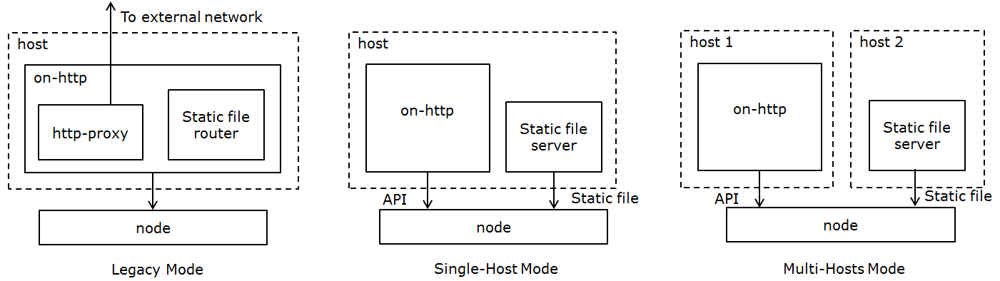

.. _static-file-server-label:

Static File Service Setup
---------------------------
There are two kinds of static files in RackHD: one of them are used for RackHD functionality, and the other
is node discovery and os installation. This section introduces a mechanism to move the latter type to a
separate third-party service in order to offload the burden of file transmission in RackHD.

Files That can be Moved into a Separate Server
~~~~~~~~~~~~~~~~~~~~~~~~~~~~~~~~~~~~
Some files, including schema, swagger configuration and others, interacts closely with RackHD, and are part of
its functionalities. Others are served for node discovery and OS installation (if users put OS image under the
same static file directory).  `on-http`_ manages all the files mentioned above by default, and the latter
(**files for discovery and OS installation**) can be moved to a third-party static file server, which will be
discussed below.

.. _on-http: https://github.com/RackHD/on-http

Diagrams for Different Working Modes
~~~~~~~~~~~~~~~~~~~~~~~~~~~~~~~~~~~~
RackHD supports three modes to serve static files. This chapter introduces the settings for the last two modes.

- Legacy Mode: nodes get static files from `on-http`_ service (default).
- Single-Host Mode: nodes get static files from another service in the same host as RackHD.
- Multi-Host Mode: nodes get static files from different host.

Setup a Static File Server
~~~~~~~~~~~~~~~~~~~~~~~~~~~~~~~~~~~~

**Prerequisites**

The server can be accessed by nodes.

**Configure a Third-Party Static File Server**

Since RackHD doesn't require any customization on a file server, users could adopt any frameworks they are
familiar with. Here takes `nginx`_ as an example about the configuration.

After `install nginx`_, modify `nginx_conf`_ to make sure the following configuration works.

.. code-block:: shell

    http {
        server {
            listen 3000;
            sendfile on;

            location / {
                root /home/onrack/;
            }
        }
    }

"3000" is the port for the server; "location" is the URI root path to access static files; and "root" specifies
the directory that will be used to search for files.

Restart nginx server after the new configuration.

.. _nginx: https://www.nginx.com/
.. _install nginx: https://www.nginx.com/resources/wiki/start/topics/tutorials/install/
.. _nginx_conf: https://www.nginx.com/resources/wiki/start/topics/examples/full/

**Copy Static File into the Server**

In the RackHD file directory on static file server (specified in "root" item above), create
a directory named "common".
Copy files from `on-imagebuilder binary in bintray`_ into this folder.

.. _on-imagebuilder binary in bintray: https://bintray.com/rackhd/binary/on-imagebuilder#files/builds

**Configure the Path of Static File Server in RackHD**

In `config.json`_, add the following fields:

.. code-block:: shell

    ...
    "fileServerAddress": "172.31.128.3",
    "fileServerPort": 3000,
    "fileServerPath": "/",
    ...

The following table describes the configurations above.

+--------------------+---------------------------------------------------------+
| Parameter          | Description                                             |
+====================+=========================================================+
| fileServerAddress  | IP address of static file server that nodes can access  |
+--------------------+---------------------------------------------------------+
| fileServerPort     | port the server is listening to.                        |
|                    | *Optional*, the default value is 80                     |
+--------------------+---------------------------------------------------------+
| fileServerPath     | the "location" in server configuration.                 |
|                    | *Optional*, the default value is '/'                    |
+--------------------+---------------------------------------------------------+

Restart RackHD services after adding these fields.

.. _config.json: https://github.com/RackHD/RackHD/blob/master/packer/ansible/roles/monorail/files/config.json

Notes
~~~~~~~~~~~~~~~~~~~~~~~~~~~~~~~~~~~~
- fileServer configurations takes higher priority than `httpStaticRoot`_, which means that when above fields exists, RackHD will use file server address for static files and ignore that specified "httpSaticRoot".
- When user creates a payload for a task, they could use {{ file.server }} as the address that nodes will use to get static file. It will direct to the correct address holding static file, depending on different working modes.
- `httpProxies`_ still works. If user has setup a static file server, but would like to use http proxy for some OS bootstrap workflow, they could modify "repo" option to still use {{ api.server }} for the address of RackHD on-http service (take `sample payload`_ as an example):
.. code-block:: json

    ...
    "install-os": {
        "version": "7.0",
        "repo": "{{ api.server }}/Centos/7.0",
        "rootPassword": "root"
    }
    ...

.. _httpProxies: http://rackhd.readthedocs.io/en/latest/rackhd/configuration.html?highlight=httpProxies
.. _httpStaticRoot: http://rackhd.readthedocs.io/en/latest/rackhd/configuration.html?highlight=httpStaticRoot
.. _sample payload: https://github.com/RackHD/RackHD/blob/master/example/samples/centos_iso_boot.json#L9
