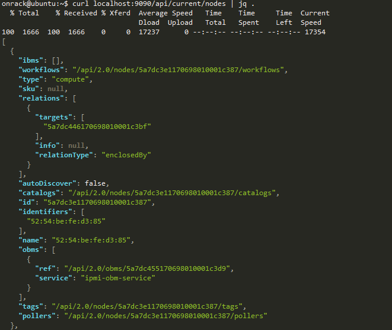

Discovery and Catalog Server Nodes
====================================

.. contents:: Table of Contents

In this module, you will learn about RackHD's discovery, catalog and poller functionality using the simulated nodes that were setup in previous labs.
* Discovery:  RackHD can dynamically discover a node that attempts to PXE boot on the network that RackHD is monitoring.
* Catalog:  perform an inventory of the discovered nodes and capture the nodes' attributes and capabilities.
* Poller:   periodically capture nodes' telemetry data from the hardware interfaces.

Clear Database
~~~~~~~~~~~~~~~~~~~~~~~

When a node attempts to PXE boot on the network managed by RackHD, RackHD will respond to the PXE boot. If RackHD is not aware of the server, it will serve up a microkernel image that will catalog the node and record it with RackHD. If the node has been already discovered (if a node's MAC has been recorded in RackHD's database), this vNode will not pxe boot RackHD's microkernel again.
In the previous steps, we have already brought up the virtual servers, the virtual nodes have already been discovered by RackHD. In this session, we will stop RackHD and clean the database so RackHD is forced to discover those nodes again.

**1. stop RackHD**

.. code-block:: shell

    sudo docker ps

You will find rackhd_mongo_1 container is running

**2. clean data base.**

.. code-block:: shell

    # clean database
    sudo docker exec -it rackhd_mongo_1 mongo rackhd
    db.dropDatabase()
    # CTRL+D to exit
    # restart RackHD
    cd src/RackHD/example/rackhd/
    sudo docker-compose restart

Discovery
~~~~~~~~~~~~~~~~~~~~~~

**1. restart InfraSIM (equivalent to reboot a physical server)**

.. code-block:: shell

    cd src/RackHD/example/infrasim/
    sudo docker-compose restart

**2. Execute "Ultra-VNC" to view the PXE progress to boot microkernel (as the snapshot)**

**3. The vNode console will hold at this step for 1 min, to catalog the node data on this server. Once the microkernel completes, the vNode will be reboot. This reboot will signify the discovery workflow has completed.**

**4. Use RackHD API to discover the Node**

.. code-block:: shell

    curl localhost:9090/api/current/nodes

The output is in json format, but it is not friendly to human to read, so please append "jq" tool to make it pretty

.. code-block:: shell

    curl localhost:9090/api/current/nodes | jq .

Now you can see one or more enclosure nodes ``"type": "enclosure"`` and computer name ``"type": "compute"``

Catalogs
~~~~~~~~~~~~~~~~~~

What's "Catalog"

* Catalogs are free form data structures with information about the nodes.
* Pluggable mechanism for adding new catalogers for additional data
* JSON documents stored in MongoDB

Example of Catalog Sources

* DMI  from dmidecode
* OHAI  aggregate of different stats in more friendly JSON format
* IPMI  typically ipmitool via KCS channel Lan info
* User info
* FRU, SEL, SDR, MC Info
* lsscsi,lspci,lshw
* Vendor specific AMI
* Storcli
* RACADM
* LLDP

**1. List all 'compute' type nodes being discovered on rackhd-server SSH console. ( you will focus on ``compute`` type nodes in remaining of this Lab.) . append ``?type=compute`` as a "query string".**

.. code-block:: shell

    curl localhost:9090/api/current/nodes?type=compute  | jq '.'

**2. Get one of the "compute" node ID demote it as a variable named ``node_id`` in the following session.**
Note: the ``node_id`` varies from different nodes, and even for the same node, the id will be changed if RackHD's database being cleaned and node re-discovered.

**3. There're various sources where the catalogs data were retrieved from. you can take a glance of them by below command.**

.. code-block:: shell

    curl localhost:9090/api/current/nodes/<node_id>/catalogs/  | jq '.' | grep source

**4. Choose one of the sources you are interested in and then append to the command. For example, this example uses ``ipmi-fru``.**

.. code-block:: shell

    curl localhost:9090/api/current/nodes/<node_id>/catalogs/ipmi-fru | jq '.'
    # or "driveId" as example
    curl localhost:9090/api/current/nodes/<node_id>/catalogs/driveId | jq '.'

Pollers
~~~~~~~~~~~~~~~~~~

What's Poller

* The "pollers" API provides functionality for periodic collection of status information from hardware devices (monitoring) IPMI, redfish and SNMP data. (SNMP data is available for vSwtich, which is not included in this vLab. while redfish pollers is neither included .)
* Regularly gather SNMP, IPMI primary mechanisms today
* Pollers capture from protocol, convert into events and provide live data stream via pub/sub mechanisms

Examples of Telemetry

* Switches Switch CPU, Memory
* Port status
* Port utilization
* Arbitrary MIB gathering capable
* PDU Socket status
* Arbitrary MIB gathering capable
* IPMI Sensors (SDR)
* Power status

.. _obm_setting:

OBM Setting
************

Before setting up the poller, please set "OBM Setting". OBM is short for "Out-of-Band-Management" and typically refers to the BMC interface on the server.
To talk with BMC, RackHD needs to be configured with the BMC's IP and credentials then bind them with a <node_id>, so that IPMI communication between node and RackHD can be established.

**In RackHD refers to this as the "OBM Setting".**

(1) For a ``<node_id>``, retrieve the ``BMC IP address``, from the catalogs among ``bmc`` source.

.. code-block:: shell

    curl localhost:9090/api/current/nodes/<node_id>/catalogs/bmc | jq '.' | grep "IP Address"

(2) Fill the BMC IP (it should be ``172.31.128.xx`` , which DHCP from rackhd-server) into below command, which will set an IPMI OBM setting on a node

.. code-block:: shell

    curl -X PUT -H 'Content-Type: application/json' -d ' { "service": "ipmi-obm-service", "config": { "host": "<BMC-IP>", "user": "admin", "password": "admin" } }' localhost:9090/api/current/nodes/<node_id>/obm

(3) Once the OBM credentials have been configured, RackHD can communicate with BMC in workflows (e.g. power-cycle the BMC or retrieve poller data)

Retrieve Pollers
*****************

(1) List the active pollers which default runs on background.

.. code-block:: shell

    curl localhost:9090/api/current/pollers| jq '.'

In below example output:

* the ``id`` is the poller's id. denote it as ``<poller_id>`` . you will refer to it very soon.
* the ``type`` means it's an IPMI poller or SNMP poller etc.
* the ``pollInternal`` is the interval of how frequent RackHD "poll" that data. Time in milliseconds to wait between polls.
* the ``node`` is the target node of the poller data comes from
* the ``command`` is what kind of IPMI command this poller is issued.

Below take ``sdr`` as example

.. code-block:: json

  {
    "id": "5a7dc446170698010001c3c6",
    "type": "ipmi",
    "pollInterval": 60000,
    "node": "/api/2.0/nodes/5a7dc446170698010001c3c6",
    "config": {
      "command": "selInformation"
    },
    "lastStarted": "2018-02-09T16:01:07.236Z",
    "lastFinished": "2018-02-09T16:01:07.294Z",
    "paused": false,
    "failureCount": 0
  }

(2) Show the poller data it captured

.. code-block:: shell

    curl localhost:9090/api/current/pollers/<poller_id>/data | jq '.'

(3) Change the interval of a poller

.. code-block:: shell

    curl -X PATCH -H 'Content-Type: application/json' -d '{"pollInterval":15000}' localhost:9090/api/current/pollers/<poller_id>

**Tips:**

Do you remember the modification on ``/src/RackHD/example/rackhd/monorail/config.json`` as below ? (in RackHD installation session)

.. code::

    "autoCreateObm": true,

The reason for doing this is to ensure the default ipmi pollers can run successfully, so RackHD will create a default BMC account during discovery step. This ensures the pollers can run smoothly at the beginning with correct user/password.
If the OBM settings are not set correctly and the pollers are started, the poller interval will become very long, and the poller data cannot be shown immediately in this Lab.

