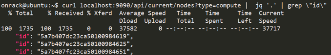
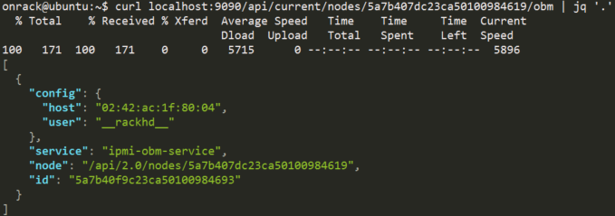
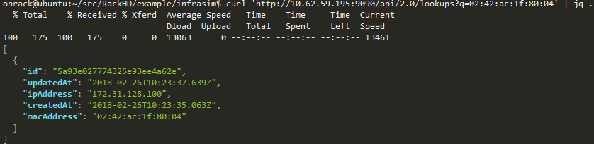
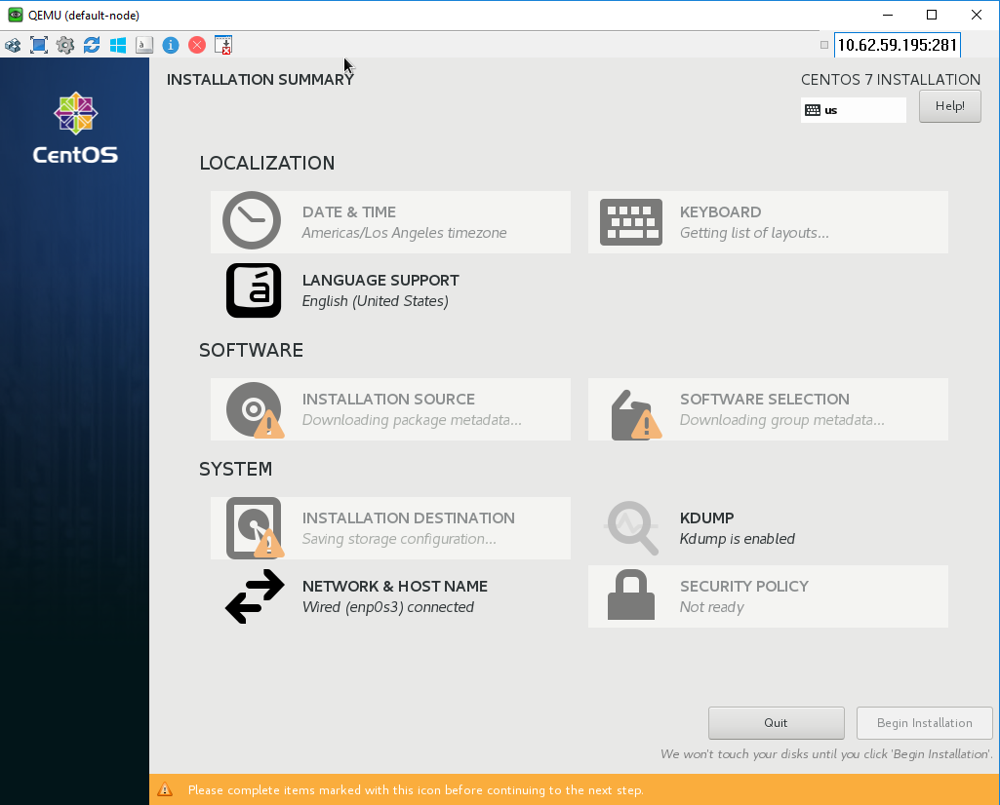
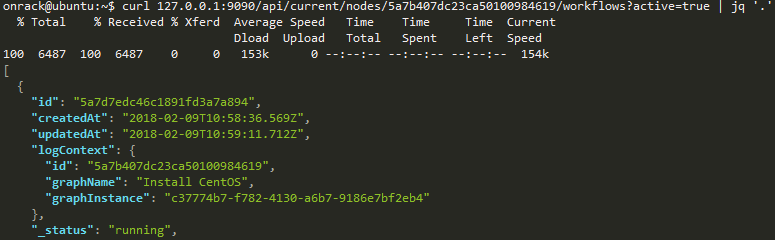
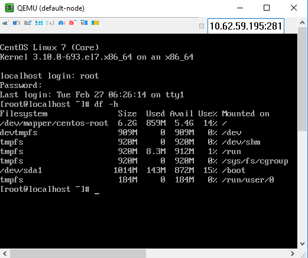

Unattended OS Installation
===========================

.. contents:: Table of Contents

Prerequisite
-------------------

**Choose a vNode which type is ``compute`` and record the vNodes node-id, here we choose ``5a7b407dc23ca50100984619`` for example**

.. code-block:: shell

    curl localhost:9090/api/current/nodes?type=compute |  jq '.' | grep \"id\"

**Ensure its OBM setting is not blank**

.. code-block:: shell

    curl localhost:9090/api/current/nodes/<node-id>/obm | jq '.'

If the response comes back [], please follow :ref:`obm_setting`, to add OBM setting.

**Retrieve BMC IP Address using the host mac address above**

.. code-block:: shell

    curl 'localhost:9090/api/2.0/lookups?q=02:42:ac:1f:80:03' | jq .

In this example, 172.31.128.100 is target vNode’s BMC IP Address

Set Up OS Mirror
--------------------

To provision the OS to the node, RackHD can act as an OS mirror repository.

.. code-block:: shell

    cd ~/src/RackHD/example/rackhd/files/mount/common
    mkdir –p centos/7/os/x86_64/
    sudo mount –o loop ~/iso/CentOS-7-x86_64-DVD-1708.iso centos/7/os/x86_64

CentOS-7-x86_64-DVD-1708.iso can download from `Official site <https://wiki.centos.org/Download>`_.

``/files/mount/common`` is a volume which is mounted to ``rackhd/files`` docker container as a static file service.
After ISO file is mounted, we need to restart file service. (This is a docker’s potential bug which cannot sync files mounted in the volume when container is running)

.. code-block:: shell

    cd ~/src/RackHD/example/rackhd
    sudo docker-compose restart

The OS mirror will be available on http://172.31.128.2:9090/common/centos/7/os/x86_64 from vNode's perspective.

Install OS with RackHD API
-----------------------------

Download Centos OS install payload example (more example of other `OS <https://github.com/RackHD/RackHD/tree/master/example/samples>`_.)

.. code-block:: shell

    cd ~
    wget https://raw.githubusercontent.com/RackHD/RackHD/master/example/samples/install_centos_7_payload_minimal.json

Edit the payload json with vim.

.. code-block:: shell

    vim install_centos_7_payload_minimal.json

    # Change the "repo" line to below.
    "repo": "http://172.31.128.2:9090/common/centos/7/os/x86_64"

Install OS (using build-in InstallCentOS workflow)

.. code:: shell

    curl -X POST -H 'Content-Type: application/json' -d @install_centos_7_payload_minimal.json    localhost:9090/api/2.0/nodes/<nodeID>/workflows?name=Graph.InstallCentOS | jq .

Monitor Progress
------------------

Use UltraVNC on the desktop to view the OS installation

Use API to monitor the running workflow.

.. code-block:: shell

    curl localhost:9090/api/current/nodes/<Node_ID>/workflows?active=true | jq .

You will see "_status": "running", for "graphName": "Install CentOS"

`Note: If it quickly returns "[]", it means the workflow failed immediately and it is most likely caused by OBM not setting. (No OBM service assigned to this node.)`

It will PXE boot from the Centos OS install image and progress screen will show up in about 5 mins, the entire installation takes around 9 mins.
You can move on the guide or revisit previous sessions, then go back after 4~5 minutes

Login to OS
-------------

Once the OS has been installed, you can try login the system via UltraVNC console.
Installed OS default username/password: ``root/RackHDRocks!``

Moreover, in this lab, the minimal payload was used. You can specific more setting in the payload and RackHD will configure the OS for you, example: the user-creation, network configuration, disk partition ...etc.
