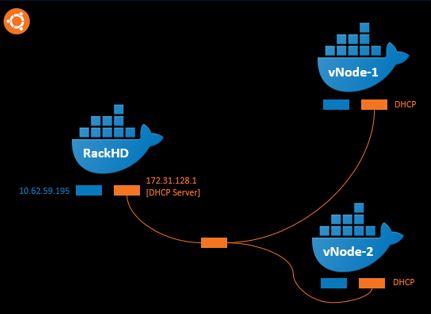

RackHD vLab Overview
======================

The lab architecture is broken down into the areas. The nodes in the black area represent a real example of a single instance of RackHD managing multiple physical nodes.
The two infrastructure Docker Containers are connected via the blue network. This blue network is required for the vLab infrastructure and is external to RackHD environment.

The RackHD portion is configured in the black area which lives within Ubuntu. In the black area, you will see 3 Docker Containers. One is running RackHD and the other two are running a simulation package called InfraSIM to simulate different types of servers. The nested Docker Containers are running Ubuntu 16.04 and are networked through the orange network.
RackHD will be installed and run in the "RackHD server" Docker. Its first NIC (network adapter) is connected to blue external network, while its second NIC will be the DHCP server port of the "orange network".
The "orange network" is managed by RackHD. In the real world, RackHD would manage the physical servers via an equivalent management network.
The "vNode-1, vNode-2" are Docker Containers which "InfraSIM" will be deployed. (InfraSIM is an open source project which simulates servers, switches, and intelligent PDUs today. The vNode Docker Container's secondary NIC are connected to the "orange network", which retrieve DHCP IP from RackHD server.
)

