RackHD try-out with Web UI
=============================

In this session, you will learn how to configure web-ui and customize a RackHD workflow to implement your own logic.

Configure on-web-ui
~~~~~~~~~~~~~~~~~~~~

* Open web browser, and then go to the following URL ``http://<ip>:<port>/ui``, replace with your own ipaddr and port.
* Click the ``gear`` button on the top right panel

.. image:: ../_static/web-ui/s1.png
    :align: center

* Enter your ``RackHD Northbound API``, then click ``save`` button, if your ip address is invalid, it will warn you ``RackHD northbound API is inaccessible``. In addition, we support secure connection ``https`` and ``API Authentication``, you can check these options in the configuration panel if you want.

.. image:: ../_static/web-ui/s2.png
    :align: center

* Then you will see all discovered nodes in the panel, and if everything us OK, you will see the red warning bar is gone and you will see all discovered nodes.

.. image:: ../_static/web-ui/s3.png
    :align: center

Workflow scenario
~~~~~~~~~~~~~~~~~~

Precondition:

1. You have discovered the node successfully

2. You have configure the OBM correctly

* You have a number of new bare metal servers coming online.
* Before the OS and applications are deployed to the new servers, you want to run a quick sanity check (diagnostic) on the servers.
* Due to a special demand of your application, you want to include a temperature check and CPU frequency check in the diagnostic step.

To fulfill the demand of scenario, you can use On-Web-UI to customize a new workflow named
My_Workflow.

This example is a simple one. However, your customized workflows can be as complex as
needed.

Workflow in RackHD
~~~~~~~~~~~~~~~~~~~~~

A workflow in RackHD is a JSON document, which describes a flow of execution and is built as a
graph. A graph is composed by several tasks.
The tasks can be executed in serial or in parallel. Each task has a conditional output that can be
used to drive the workflow down different paths based on how the task is completed (for example,
Error, Failed, Succeeded).

Add a new workflow
--------------------

Go to Workflow Center -> workflow Editor

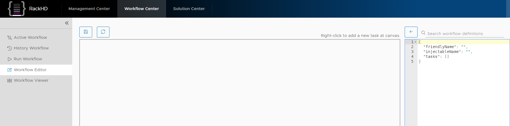

Right click on the canvas to add tasks, type pxeboot and choose ``Task.Obm.Node.PxeBoot`` task.

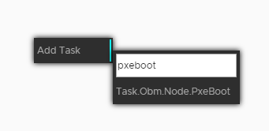

A Task block will display in the canvas as well as the json data will display on the right

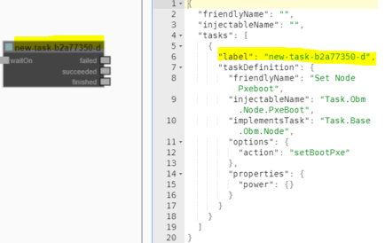

The task will be named as ``new-task-xxxxx`` (xxxxx is randomly generated), to make it more friendly you can change the label property ('set-boot-pxe' for this example) on the right panel.

.. important::
    You must change the task name before setting up the task relationship.

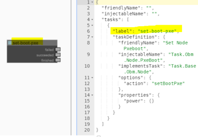

Add ``Task.Obm.Node.Reboot`` task and change the label to ``reboot``

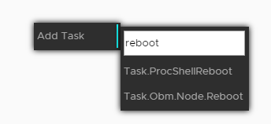

Add ``Task.Linux.Bootstrap.Ubuntu`` task and change the label to ``bootstrap-ubuntu``

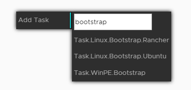

Add ``Task.Linux.Commands`` task and change the label to ``diagnostic``

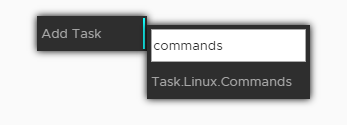

In the workflow editor window on the right hand side, you can see three default shell commands for the diagnostic task that you created.

The following example shows the default, automatically generated, json output.

.. code::

    "commands": [
        {
            "command": "sudo ls /var",
            "catalog": {
                "format": "raw",
                "source": "ls var"
            }
        },
        {
            "command": "sudo lshw -json",
            "catalog": {
                "format": "json",
                "source": "lshw user"
            }
        },
        {
            "command": "test",
            "acceptedResponseCodes": [ 1 ]
        }
    ]

Update the "commands" line by adding the following commands. You can edit the json content inside the visual workflow editor sub-window.

.. code::

    "commands": [
        {
            "command": "sudo lshw -json",
            "catalog": {
                "format": "json",
                "source": "customized-lshw"
            }
        },
        {
            "command": "temp=$( sudo ipmitool sdr|grep Temp|head -n1| awk '{print $3}' ) &&
            echo Temperature: $temp && if [ $temp -gt 30 ]; then echo [Error] Over Temperature!
            $temp; exit -1; fi",
            "catalog": {
                "format": "raw",
                "source": "customized-temp"
            }
        },
        {
            "command": "CPU_HZ=$(cat /proc/cpuinfo |grep MHz | head -n1 | awk '{print $4}')
            && echo CPU frequency : $CPU_HZ && if [ $(awk 'BEGIN{ print $CPU_HZ <2000 }') -eq 1 ];
            then echo [Error] Wrong SKU. CPU frequency is too low: $CPU_HZ; exit -1; fi",
            "catalog": {
                "format": "raw",
                "source": "customized-CPU"
            }
        }
    ]

Explanation of the above 3 shell command tasks (optional step)

you can skip this option step.

Below it will explain the shell commands' meaning in the last step.

1. It will list the hardware by 'lshw' and catalogs and output (you can find the output from catalog after workflow completion.)

.. code::

    "command" : "sudo ls /var",
    "catalog" : {
        "format" : "raw",
        "source" : "ls var"
    }

2. As below:This is a diagnostic sample for temperature. It's comparing the hardware's Ambient temperature with a threshold value (20 as an example) and fail this job if hotter than that.20 as an example) and fail this job if hotter than that.

.. code-block:: shell

    temp=$( sudo ipmitool sdr|grep Temp|head -n1| awk '{print $3}' ) && \
    echo Temperature: $temp && \
    if [ $temp > 20 ]; then \
        echo [Error] Over Temperature! $temp; \
        exit -1; \
    fi

3. It is comparing the hardware's CPU frequency with a threshold value (2500 as an example) and fail this job if lower than that.

.. code-block:: shell

    CPU_HZ=$(cat /proc/cpuinfo |grep MHz | head -n1 | awk '{print $4}') && \
    echo CPU frequency : $CPU_HZ && \
    if [ $(awk 'BEGIN{ print $CPU_HZ <2000 }') -eq 1 ]; then \
        echo [Error] Wrong SKU. CPU frequency is too low: $CPU_HZ; \
        exit -1; \
    fi

Set the task relationship
---------------------------

Tasks display indicators that you can connect to set the task relationship. Each task displays a
trigger indicator in the top left.
Each task also displays the following condition indicators on the right side:

     * Red: when fail
     * Green: when success
     * Blue: when running
     * Yellow: when cancelled
     * Grey: when pending

For example, when you connect the green condition indicator of task A to the trigger indicator for
Task B: when task A has succeeded, then task B is triggered.

Before setting the relationship we need to add waitOn input for the tasks, right click on the task block and click ``Addinput``.

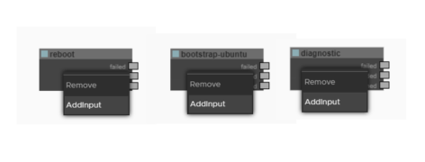

Then connect the ``finished`` output of ``set-pxe-boot`` task to ``reboot``'s ``waitOn`` input, ``reboot``'s ``succeeded`` output connect to ``bootstrap-ubuntu`` and ``diagnostic``'s ``waitOn`` input

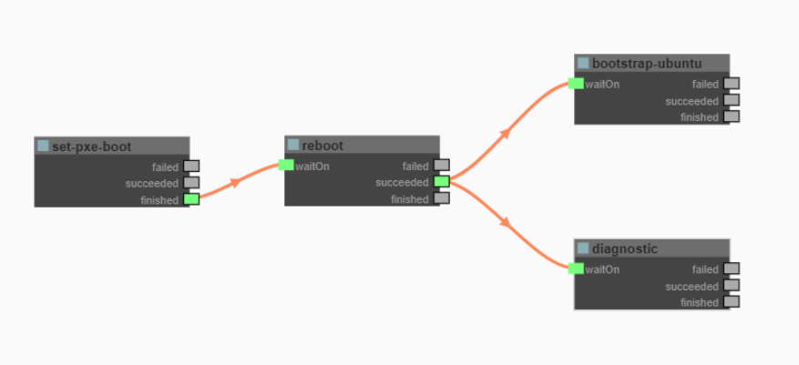

When the reboot task is successfully completed, the ``bootstrap-ubuntu`` task and ``diagnostic`` task are started.

Now we can save the workflow, before saving the workflow we need to fill in the ``friendlyName`` and ``injectableName`` on the right of the workflow editor panel. Then click the save button.

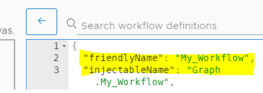

Go to ``Workflow Viewer`` session and filter the workflow by name. choose ``My_Workflow``

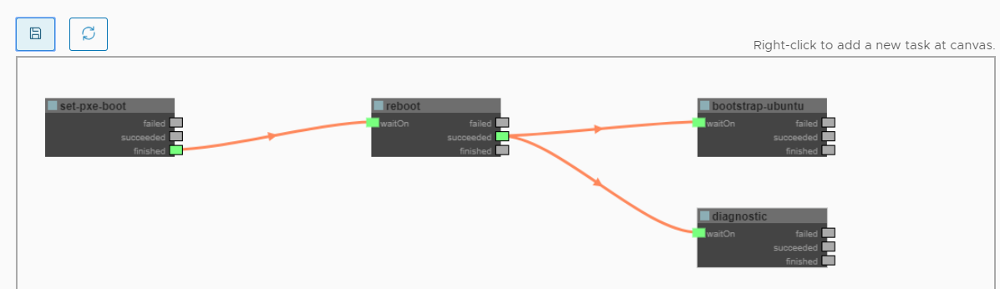

Go to ``Run Workflow`` session, choose your ``Node id`` or any property like ``Node Name``, ``OBM Host`` etc, then type ``Graph.My_Workflow`` in ``Graph`` field, then click ``RUN WORKFLOW`` button

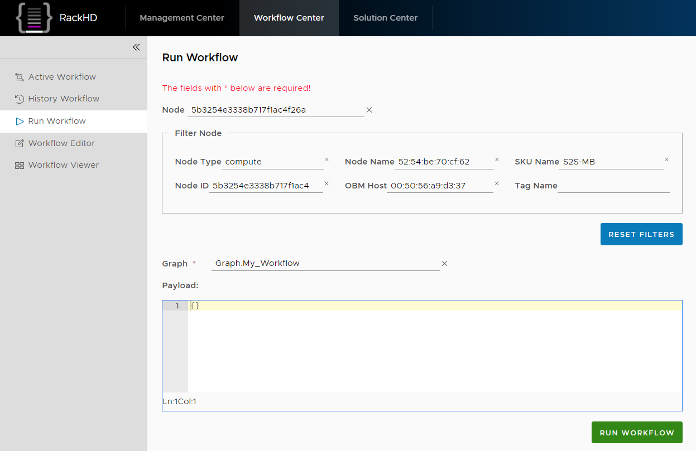

You can also use ``UltraVNC Viewer`` tool to check your node's bootstrap progress.

Go back to ``Workflow Viewer`` session, you will see your workflow's running progress. After serval minutes, the workflow is completed, and the color of the workflow indicates the running result (red for fail, green for success, yellow for cancelled)

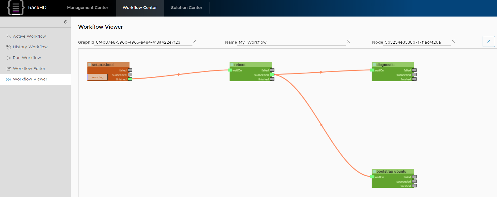
