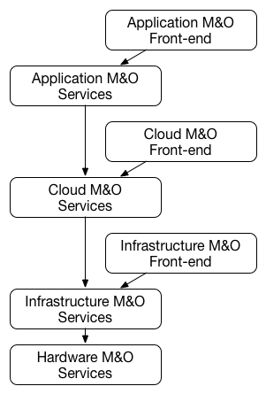
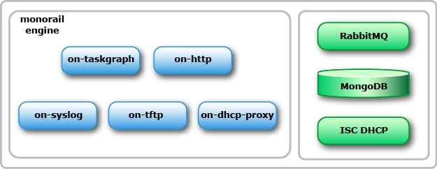
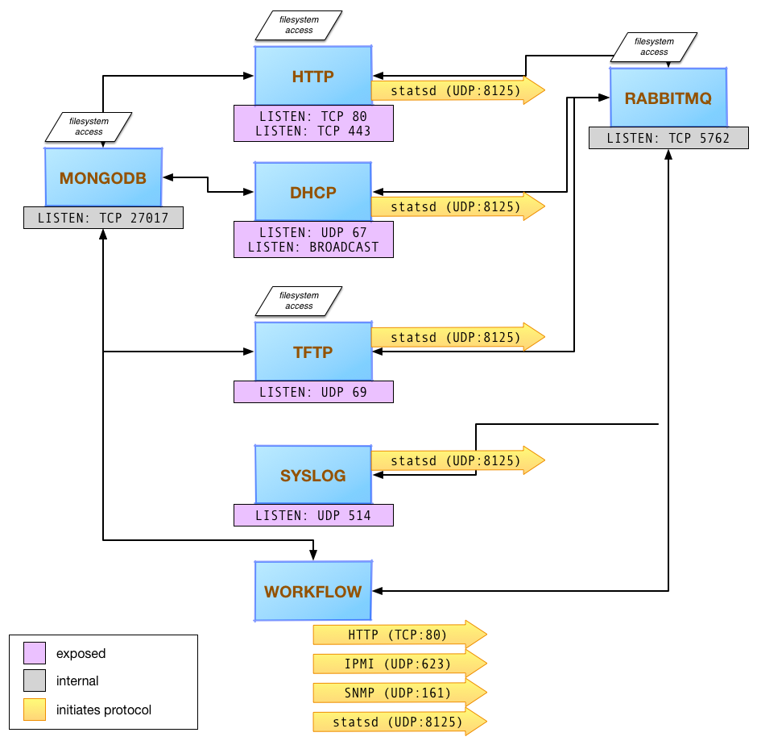

Software Architecture
=====================================

RackHD enables much of its functionality by providing PXE boot services
to machines that will be managed, and integrating the services providing
the protocols used into a workflow engine. RackHD is built to download a
microkernel (a small OS) crafted to run tasks in coordination with the workflow
engine. The default and most commonly used microkernel is based on Linux, although
WinPE and DOS netbooting is also possible.

Theory of operation and integration with other automation systems
-----------------------------------------

The base idea of RackHD was born from the realization that our effective automation
in computing and improving efficiencies has come from multiple layers of orchestration,
each building on a lower layer. A full featured API driven environment that is effective
spawns additional wrappers to combined those lower level pieces into patterns that are
at first experiment, and over time become either defacto, or concrete, standards.

Application automation - such as services like Heroku or CloudFoundry - are built overlying
infrastructure as a service API layers (AWS, Google Cloud Engine, SoftLayer, OpenStack, etc).
Those services in turn are often installed, configured, and managed by automation in
the form of software configuration management: Puppet, Chef, Ansible, etc. To automate
datacenter rollouts, managing racks of machines, etc - these are built on automation
to help roll out software onto servers - Cobbler, Razor, etc.

The closer you get to hardware, the less automated systems tend to become. Cobbler
and SystemImager were mainstays of early datacenter management tooling. Razor expanded
on that base system (or Hanlon, depending on where you're looking), supported mainly by
people working to implement further automation solutions.

RackHD was built to expand out the capabilities of Hardware M&O needs
(Management and Operations) including active metrics and telemetry, integrated and
annotated monitoring of underlying hardware systems, firmware updating, in addition to
the features that have been the mainstay of the hardware automation world - PXE booting
and automated installation of OS and software.

RackHD is meant to enable deeper and fuller automation and "play nicely" with
both existing and future potential systems, to fill holes that exist with past and
current open source efforts, and to help enable converged infrastructure automation.

Major Components
----------------

The software is roughly divided into a simplified REST API oriented towards a common
data model and easy integration, and an underlying workflow engine (code named the
"monorail engine", after a popular Seattle coffee shop: http://www.yelp.com/biz/monorail-espresso-seattle).

.. image:: _static/high_level_architecture.png

The upper layer of the architecture, called the "onserve executive" communicates using
both an internal REST API and AMQP as a message bus between the various processes. This layer is still under development.

The lower layer of the architecture - the "monorail engine" provides the workflow
engine and coordinated agents for interacting through multiple protocols with remote
systems. The monorail engine is broken into independent processes with a mind to support
scaling or distributing them independently by protocol, and communicates together
using message passing over AMQP, and stores data as needed for persistence in MongoDB.

Onserve Executive
---------------------

The upper layer of the architecture, called the “onserve executive” communicates using both an internal REST API and AMQP as a
message bus between the various processes. Onserve executive provides the simplified API and is built to encapsulate the
monorail engine, converting internal data models into a common data format based on the Redfish 1.0 specification (http://www.dmtf.org/standards/redfish).

OnServe executive conversions are still in development. For more information, contact us at: rackhd@googlegroups.com.

Monorail Engine
-------------------

* ISC DHCP

    A DHCP server is a critical component of a standard PXE (https://en.wikipedia.org/wiki/Preboot_Execution_Environment) process,
    providing IP addresses dynamically using the DHCP protocol

* on-dhcp-proxy

    The DHCP protocol supports getting additional data specifically for the PXE
    process from a secondary service that also responds on the same network as
    the DHCP server. The DHCP proxy service provides that information, generated
    dynamically from the workflow engine.

* on-tftp

    TFTP is the common protocol used to initiate a PXE process, and on-tftp is
    tied into the workflow engine to be able to dynamically provide responses
    based on the state of the workflow engine, and to provide events to the workflow
    engine when servers request files via TFTP

* on-http

    on-http provides both the REST interface to the workflow engine and data model APIs
    as well as a communication channel and potential proxy for hosting files and serving
    them to support dynamic PXE responses. RackHD commonly uses iPXE as its initial
    bootloader, loading remaining files for PXE booting via HTTP and using that communications
    path as a mechanism to control what a remote server will do when rebooting.

    on-http also serves as the communication channel for the microkernel to support
    deep hardware interrogation, firmware updates, and other actions that can only be
    invoked directly on the hardware and not through an out of band management channel.

* on-syslog

    on-syslog is a syslog receiver endpoint that channels all syslog data sent to the
    host into the workflow engine to provide annotated and structured logging
    from the hosts under management.
