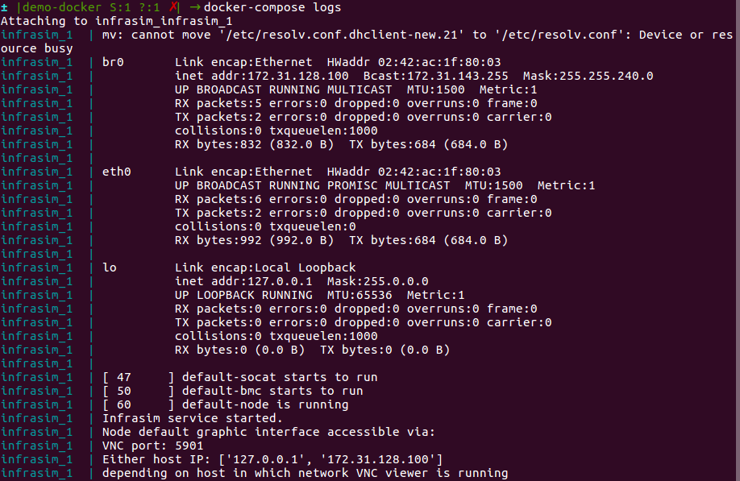
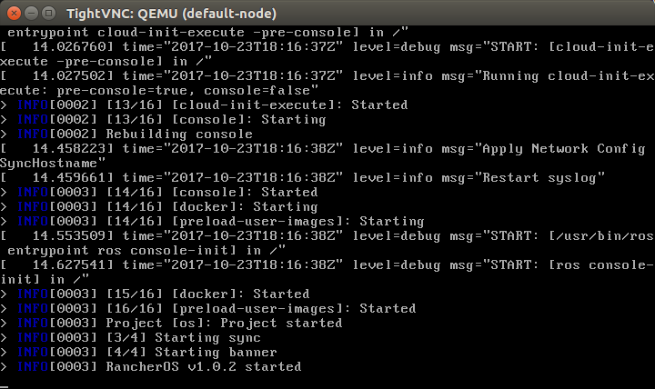
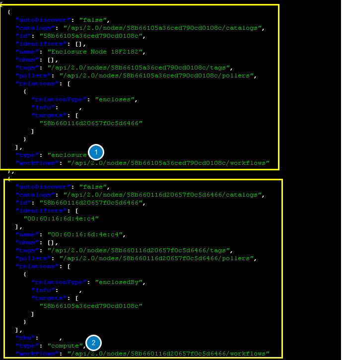
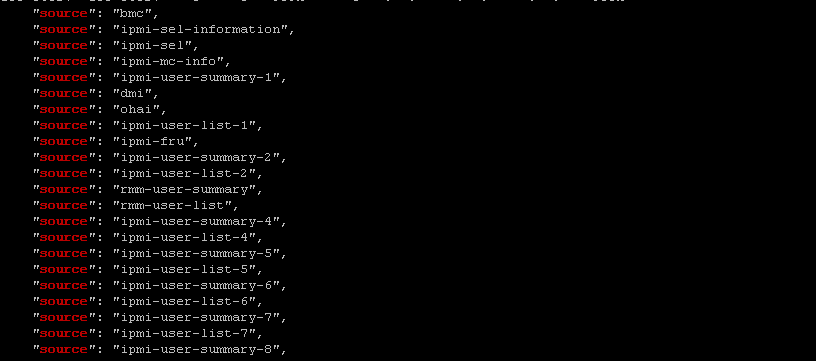
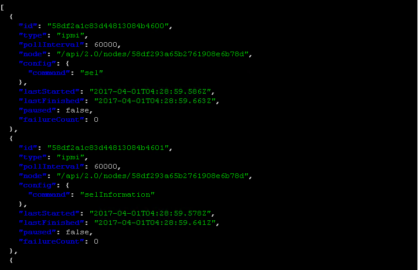

Automatic Discovery and Catalog Server Nodes
===============================================

In this module, you will learn about RackHD's discovery, catalog and poller functionality by using the simulated virtual nodes created by Infrasim.

- Discovery: RackHD can automatically discover a node that attempts to do PXE boot on the network that RackHD is monitoring.

- Catalog: RackHD can capture the nodes' attributes and capabilities.

- Poller: RackHD can periodically capture nodes' telemetry data from the hardware interfaces.

Discovery
----------
The infrsim/default.yml file is used to defined the virutal node's configuration.  This demo uses an emulated quanta_d52 vnode. If you want to learn more about InfraSIM, you can go to https://github.com/InfraSIM.

UltraVNC Viewer is used to show the console of vnode. In this environment, the vnode console will be availabe on the rackhd_southbound network on port `5901`.

1. Run up a vnode

To start a vnode, the follwing command should be run from the rackh/example/infrasim direcotry.

.. code::

  docker-compose up -d

You can execute command on host to check whether quanta_d51 vnode is up successfully. If the status of quanta_d51 vnode is ``running``, quanta_d51 is up successfully.

.. code::

  docker-compose ps

Once the virutual node is up, you can connect to it via a vnc viwer on port 5901.  You first need to look at the log output to find the ip address of the bridge, br0, the virtual node is connected to.

.. code::

  docker-compose logs

Now conncet via a vncviewer to this node on port 5901

.. code::

  vncviewer 172.31.128.100:5901

3. The vNode console will pause for about 1 minute while Rackhd catalogs the vnode information.  The vNode will reboot after cataloging finishes. This reboot indicates that the discovery workflow is completed.

.. image:: ../_static/infrasim_discovery_finished.png
     :align: center

4.Retrieve the nodes by typing the following RackHD API to discover the node.

.. code::

   curl localhost:9090/api/2.0/nodes | jq '.'

You can see one or more vnodes whose type is "enclosure" or "compute".

NodeId
-------

NodeId is the unique Identity of a node in RackHD. List all the compute type nodes being discovered on the rackhd-server SSH console by typing the following command. Append "?type=compute" as a query string.

You will focus on compute type nodes in this module

.. code::

  curl 127.0.0.1:9090/api/2.0/nodes?type=compute | jq '.'

In the following json output, the compute node ID is ``58b660116d20657f0c5d6466``. You will take it as a variable named <node_id> in the following module.

**Note**: The node_id varies for different nodes. Even for the same node, the Node ID changes if the RackHD database is being cleaned and the node rediscovered.

Do not use the example ``58b660116d20657f0c5d6466`` in your vLab. Use the displayed Node ID in your lab.

Retrieve Catalogs
-----------------

Catalogs are described as the following:

- Free form data structures with information about the nodes
- Pluggable mechanisms for adding new catalogers for additional data
- JSON documents stored in MongoDB

Examples of catalog sources include the following:

- Drive smart information
- DriveId catalog including system identified drive information
- DMI from `dmidecode` command
- OHAI aggregate of different stats in more friendly JSON format
- IPMI information gets per ipmitool over KCS channel LAN information
- FRU, SEL, SDR, MC information
- `lsscsi`, `lspci`, `lshw` commands output
- Raid information can be got via storcli/perccli tool
- Dell computers provide some catalogs retrieved from RACADM tool
- LLDP

**Specify The Catalogs Source**

1. To view the sources where the catalogs data was retrieved from, type the following command.

**Note**: the <node_id> is the Node-ID retrieved from Step 3.

.. code::

    curl 127.0.0.1:9090/api/2.0/nodes/<node_id>/catalogs/ | jq '.' | grep source

2. Select one of the sources you are interested in, and then append to the command. For example, the following example use ipmi-fru

.. code::

    curl 127.0.0.1:9090/api/2.0/nodes/<node_id>/catalogs/ipmi-fru | jq '.'

or "driveId" as example

.. code::

   curl 127.0.0.1:9090/api/2.0/nodes/<node_id>/catalogs/driveId | jq '.'

Retrieve Pollers
------------------------

What's Poller
~~~~~~~~~~~~~

- The pollers API provides functionality for periodic collection of IPMI and SNMP data.
- IPMI Pollers can be standalone or can be associated with a node. When an IPMI poller is associated with a node, it will attempt to use that node’s IPMI OBM settings in order to communicate with the BMC. Otherwise, the poller must be manually configured with that node’s IPMI settings.
- SNMP pollers can be standalone or associated with a node. When an SNMP poller is associated with a node, it attempts to use that node’s snmpSettings in order to communicate via SNMP. Otherwise, the poller must be manually configured with that node’s SNMP settings.

Examples of Telemetry
~~~~~~~~~~~~~~~~~~~~~

- Switches Switch CPU, Memory
- Port status
- Port utilization
- Arbitrary MIB gathering capable
- PDU Socket status
- Arbitrary MIB gathering capable
- IPMI Sensors (SDR)
- Power status

Retrieve Pollers
~~~~~~~~~~~~~~~~~

1. On rackhd-server,list the active pollers which by default run in the background, by typing the following command.

.. code::

  curl 127.0.0.1:9090/api/2.0/pollers| jq '.'

Below is a definition of each field in the example output below:

- "id" is the poller's id. Denote it as <poller_id>. you will refer to later.
- "type" means it is an IPMI poller or SNMP poller, and so on.
- "pollInternal" is the interval for the frequency that RackHD polls that data. The time is the milliseconds to wait between polls.
- "node" is the target node of the poller that the data comes from.
- "command" is the kind of IPMI command that this poller is issued.

Note: Record listed below is an example. The output on your screen will look similar with different
data.

.. code::

 {
  "id": "58b66105a36ced790cd01091",
  "type": "ipmi",
  "pollInterval": 30000,
  "node": "/api/2.0/nodes/58b660116d20657f0c5d6466",
  "config": {
  "command": "sdr"
  },
  "lastStarted": "2017-03-01T06:22:35.417Z",
  "lastFinished": "2017-03-01T06:22:55.241Z",
  "paused": false,
  "failureCount": 0
 }

2. Show the poller data, by typing the following command.

.. code::

  curl 127.0.0.1:9090/api/2.0/pollers/<poller_id>/data | jq '.'

3. Change the interval of a poller, by typing the following command.

.. code::

 curl -X PATCH -H 'Content-Type: application/json' -d '{"pollInterval":15000}' 127.0.0.1:9090/api/2.0/pollers/<poller_id>

