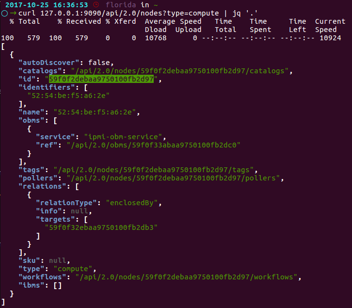
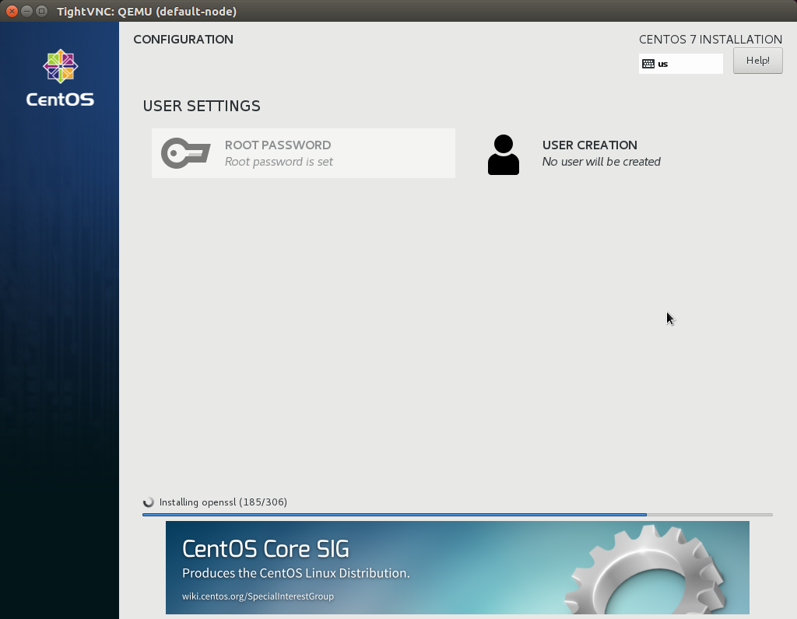

Perform an Unattended OS Install
=================================

Overview
------------

In this section, you will leverage RackHD to perform an unattended install of CentOS 7 onto a discovered compute node.  The config.json file for this demo already has an http proxy server set up for http://mirror.centos.org/  The install workflow will use this proxy to install the OS image.

Prerequisite
~~~~~~~~~~~~~

The compute vNode discoved in the previous section will be used as the OS-Install target node in this Lab. Get the information of vnode.

.. code::

    curl 127.0.0.1:9090/api/2.0/nodes?type=compute | jq '.'

The ``node-id`` specified in the response will be used in the following steps.

Set Up OS Mirror
~~~~~~~~~~~~~~~~

To provision the OS to the node, RackHD can act as an OS mirror repository.

1. Download CentOS iso: CentOS-7-x86_64-Everything-1708.iso, from https://www.centos.org/download/.

2. Create OS mirror from an ISO image by typing below command. (Note: The iso file supposes to be downloaded in ~/iso)

.. code::

   cd ./RackHD/example/rackhd/files/mount/common/
   mkdir -p centos/7/os/x86_64/
   sudo mount -o loop ~/iso/CentOS-7-x86_64-Everything-1708.iso ./centos/7/os/x86_64/

Install OS with RackHD API
~~~~~~~~~~~~~~~~~~~~~~~~~~

In this step, you will create a payload file, and then leverage the RackHD build-in workflow to install the OS on the vNode.

1. Create a payload json file by for the OS install.

Create a file named install_centos_7_payload.json and add the following to it:

.. code:: JSON

    {
        "name": "Graph.InstallCentOS",
        "options": {
            "defaults": {
                "version": "7",
                "repo": "http://172.31.128.2:9090/common/centos/7/os/x86_64",
                "rootPassword": "RackHDRocks!"
            }
        }
    }

2.  Install the OS by using built-in "Graph.InstallCentOS" workflow and the ``<node-ID>`` that you obtained in the Prerequisites at the beginning of this lab. Run the following command

.. code::

  curl -X POST -H 'Content-Type: application/json' -d @install_centos_7_payload.json 127.0.0.1:9090/api/2.0/nodes/<node-ID>/workflows?name=Graph.InstallCentOS | jq '.'

Installation Progress
~~~~~~~~~~~~~~~~~~~~~

1. Run the following API to monitor a workflow that is running.

.. code::

  root@rackhd:/home/vagrant# curl 127.0.0.1:9090/api/2.0/nodes/<Node_ID>/workflows?active=true | jq '.'

In the json output RackHD responses, you will see "_status" field is "running", and "graphName" field is "Install Cent OS",

`Note: If the "[]" is returned, the workflow failed immediately. The failure is likely because the OBM setting is not set. (No OBM service assigned to this node.)`

2. Use VNC to monitor the corresponding vNode's console.

3. It will PXE boot from the CentOS install image.  And start the OS installation:

4. After the OS install has completed, you can now log into the system using the rootPassword you specified in the payload file above.
