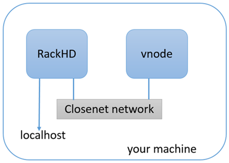

RackHD: Local Docker Based Environment Set-up
================================================

This tutorial will walk you through getting an instance of RackHD up and running on your local desktop or laptop, this will enable you to see the hosted API documentation and experiment with the APIs.

Prerequisites
--------------

.. sidebar:: jq

    You can get details on how to use `jq`_ at https://stedolan.github.io/jq/manual/.
    By default it colorizes the syntax highlighting and pretty prints javascript data structures.

    Another option that can provide the same pretty printing is use::

        | python -mjson.tool

You will need to install `Docker`_ and `Docker Compose`_ before setting up the environment.

You may also want to consider installing `jq`_ which provides a command-line
oriented tool for pretty printing and filtering JSON structured data.

.. _Docker: https://docs.docker.com/engine/installation/
.. _Docker Compose: https://docs.docker.com/compose/install/
.. _jq: https://stedolan.github.io/jq/

.. container:: clearer

   .. image :: ../_static/invisible.png

What We're Setting up
----------------------

The Docker Compose file will download the latest released versions of the RackHD Services from the RackHD DockerHub.  It will create two docker bridge networks to run the services.  The rackhd_admin network will be used to connect the services together and to access the RackHD APIs.  The rackhd_southbound network will be used by RackHD to connect to the virtual nodes.

The Docker Compose setup also enables port forwarding that allows your localhost to access the RackHD instance:

- localhost:9090 redirects to rackhd_admin:9090 for access to the REST API
- localhost:9093 redirects to rackhd_admin:8443 for secure access to the REST API

.. container:: clearer

   .. image :: ../_static/invisible.png

Set up RackHD in Docker using Docker Compose
--------------------------------------------
How to set up these environments is shown as follows.

1. Clone the RackHD repository

    .. code::

        git clone https://github.com/RackHD/RackHD.git
        cd RackHD/example

2. Download and start the RackHD services with the docker-compose up file.  This command will load the configuration from the docker-compse.yml file.

    .. code::

        docker-compose -f docker-compose.yml up -d

    .. image:: ../_static/docker_compose_up.png
         :align: center

3. Now use the docker-compose ps command to check whether the RackHD services are now up and running.

    .. code::

        docker-compose ps

    If RackHD is set up successfully, the result will be shown as follows.

    .. image:: ../_static/docker_compose_ps.png
         :align: center

4. The command ``docker-compse logs`` will output the logs from all the running RackHD services.  Additionally, you can stop the services with the command ``docker-compose stop``, or stop and delete the services with ``docker-compopse down``.
