Interfacing with The RESTful API
===============================

Overview
--------

In the previous modules, you had the opportunity to experiment with some RackHD APIs. In this module you will learn about two different RESTful endpoints in RackHD and experiment with them.

RackHD is designed to provide a REST (Representational state transfer) architecture to provide a RESTful API. RackHD currently has two RESTful interfaces: a Redfish API and native REST API 2.0.

The Redfish API is compliant with the Redfish specification as an additional REST API. It provides a common data model for representing bare metal hardware, as an aggregate for multiple backend servers and systems.

The REST API 2.0 provides unique features that are not provided in the Redfish API.

Restful API ( v2.0 )
-----------------

**REST API ( v 2.0) - Get workflow history**

Before the following operations are excuted, you need to ssh the vagrant box first. ``vagrant ssh dev`` can enter the demo environment. ``vagrant ssh dev_ansible`` can enter development environment. The **<Node-ID>** is retrieved from 7.2.

.. code::

  vagrant@rackhd:~$ curl localhost:8080/api/2.0/nodes/<Node-ID>/workflows | jq '.'

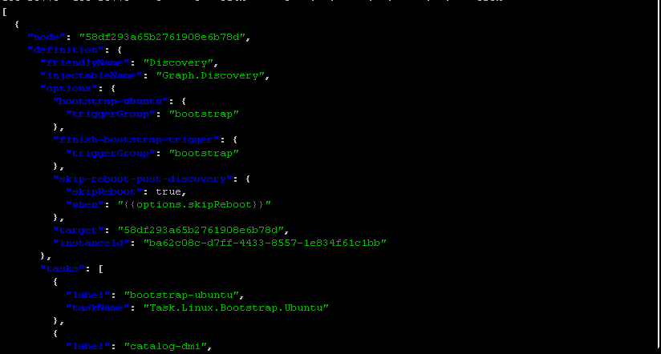

**REST API ( v 2.0) - Get active workflow**

.. code::

   vagrant@rackhd:~$ curl localhost:8080/api/2.0/nodes/<Node-ID>/workflows?active=true | jq '.'

In the following example, the return is blank ([]), which means no workflow is actively running on this node.

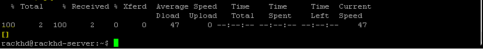

**REST API ( v 2.0) - Show RackHD configurations**

Show the RackHD configurations, by running the following command.

.. code::

 vagrant@rackhd:~$ curl localhost:8080/api/2.0/config | jq '.'

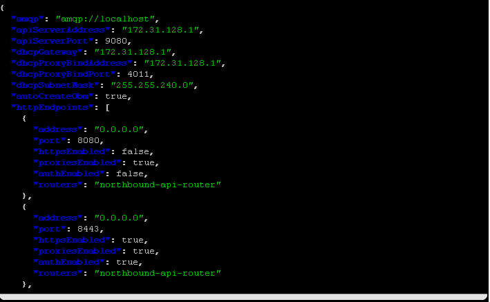

**REST API ( v 2.0) - lookup table**

Dump the IP address in the lookup table (where RackHD maintain the nodes IP), by running the following command.

.. code::

  vagrant@rackhd:~$ curl localhost:8080/api/2.0/lookups | jq '.'

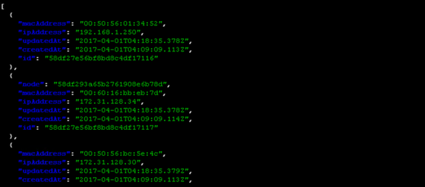

**REST API ( v 2.0) - built-in workflow**

- Show the name of all built-in workflow

.. code::
  
   vagrant@rackhd:~$ curl localhost:8080/api/2.0/workflows/graphs | jq '.' | grep injectableName | grep "Graph.*" | grep -v "Task"

As below output example, you will find lots of handy built-in workflow which RackHD carries, which you can leverage them directly.

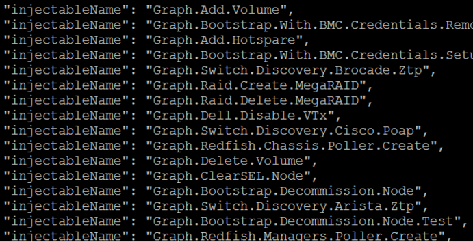

**REST API ( v 2.0) - issue a workflow**

Post a workflow to a specific node by running the following command.

In the following example, to post a workflow to Reset a Note, the Node_id is obtained by the "curl localhost:8080/api/2.0/nodes | jq '.' "API.

.. code::
 
   vagrant@rackhd:~$ curl -X POST -H 'Content-Type: application/json' 127.0.0.1:8080/api/2.0/nodes/<Node_id>/workflows?name=Graph.Reset.Node | jq '.'

Then the vNode is powered cycle and rebooted.

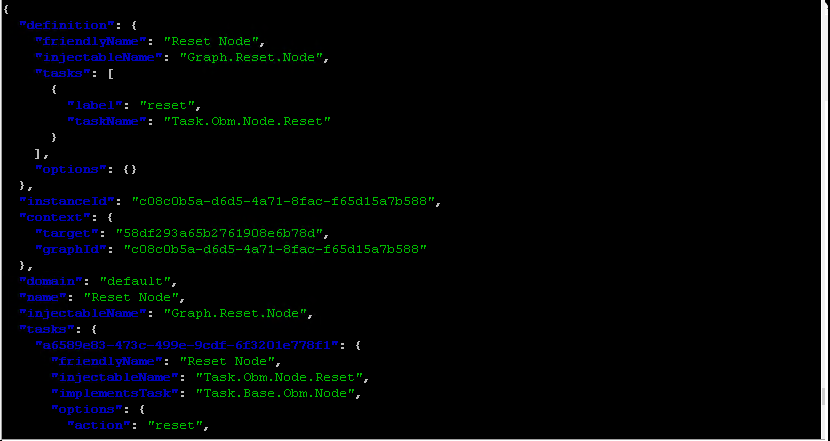

**Redfish API - Chassis**

List the Chassis that is managed by RackHD (equivalent to the enclosure node in REST API 2.0), by running the following command.

.. code::

  vagrant@rackhd:~$ curl 127.0.0.1:8080/redfish/v1/Chassis| jq '.'

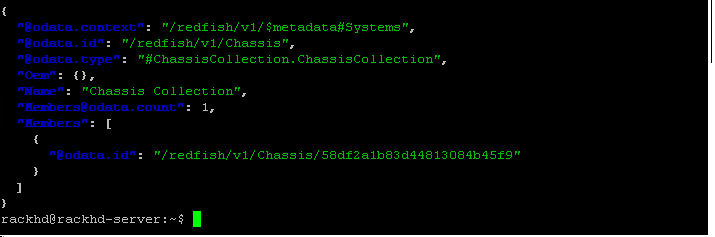

**Redfish API - System**

1. In the rackhd-server, list the System that is managed by RackHD (equivalent to compute node in API 2.0), by running the following command

.. code::
  
 vagrant@rackhd:~$ curl 127.0.0.1:8080/redfish/v1/Systems| jq '.'

2. Use the mouse to select the **System-ID** as below example, then the ID will be in your clipboard. This ID will be used in the following steps.

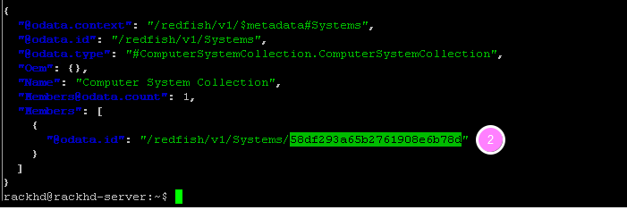

**Redfish API - SEL Log**

.. code::

   vagrant@rackhd:~$ curl 127.0.0.1:8080/redfish/v1/systems/<System-ID>/LogServices/Sel| jq '.'

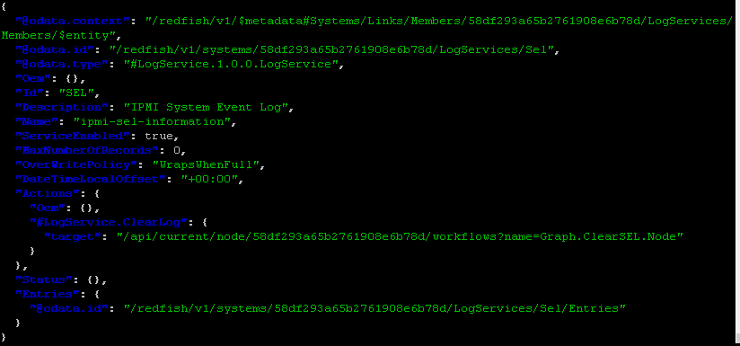

**Redfish API - CPU info**

.. code::

  vagrant@rackhd:~$ curl 127.0.0.1:8080/redfish/v1/Systems/<System-ID>/Processors/0| jq '.'

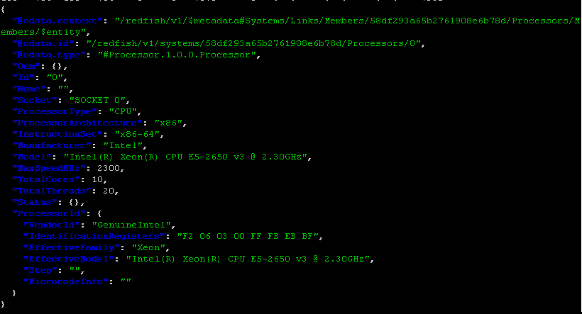

**Redfish API - Helper**

Show the list of RackHD Redfish APIs' by running below command:

.. code::
  
  vagrant@rackhd:~$ curl 127.0.0.1:8080/redfish/v1| jq '.'

.. image:: ../_static/redfish_helper.png
     :align: center

Swagger UI
-----------

The following steps provide an overview of how to use the Swagger UI.

1. Open "Chrome" and then type ``http://<IP>:9090/swagger-ui`` in the URL address box. The <IP> should be set to the node ip where the environment is set up. For example, if you set up environemt on windows, the <IP> should be set to ``localhost``. If you set up environment on Linux, you can get node ip first by the command ``ifconfig eth0`` and then replace <IP>.

2. You can ignore the Update Keys button and Login button. They take no effect when "authEnabled == false" is set in the RackHD configuration file (/opt/monorail/config.json).

3. Click /api/2.0 or /redfish/v1, to expand the API list.

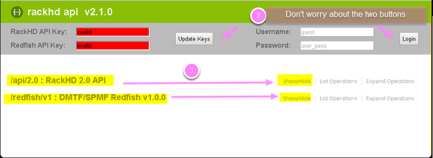

4. Get a Node ID by scrolling down the /API 2.0 list and clicking the "/nodes" API.

5. Click Get a list of nodes on the right side of the bar, to expand the details for this API.The details for this API are displayed (for example, description, parameters, response code).

6. Click Try it out! button, to invoke this API.

Notes: Some APIs do not require parameters. Some APIs require that you specify a unique Node ID or other parameters. Enter any necessary parameters and Swagger UI builds the RESTful API request and sends it when you click **Try it Out**.

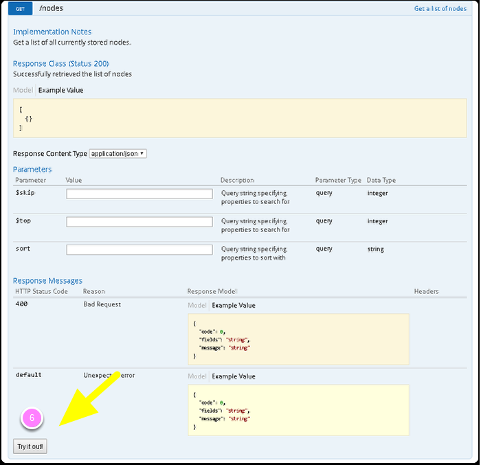

7. The RackHD response is displayed. The Response Body is output in a json format from RackHD and is exactly the same as the return from command line API.

8. Copy a node ID with the type "compute", instead of "enclosure".

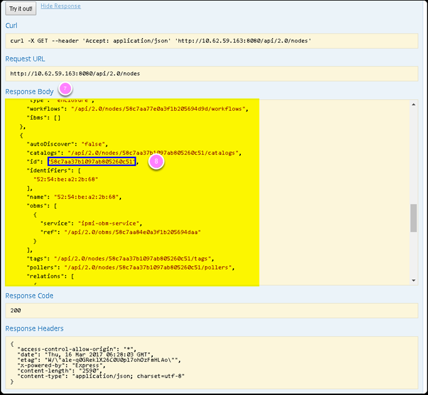

9. From the API list, under /nodes API, find /nodes/{identifier}/catalogs, and then click the **"Get the catalogs fro a node"**.

10. Paste the node ID that you copied in step 6.

11. Click the **Try it out!**. The catalog data for this node is displayed.

12. Experiment with other APIs.

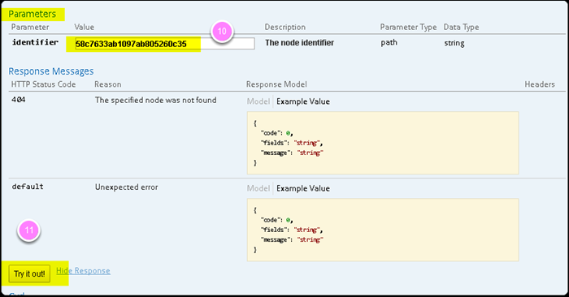
