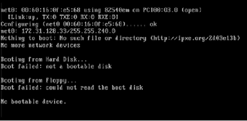
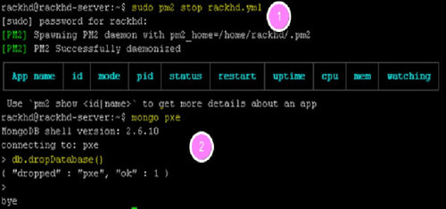
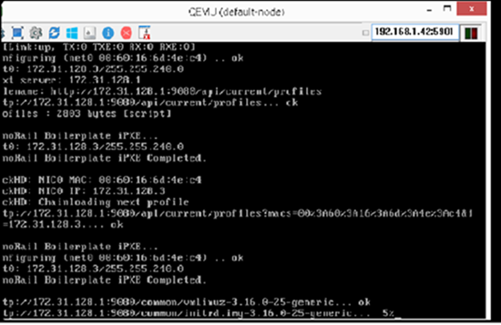
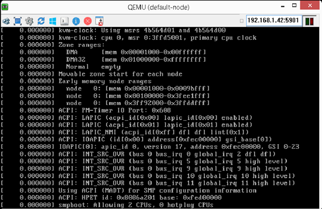
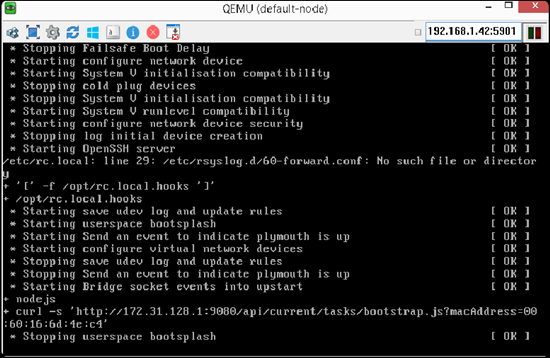
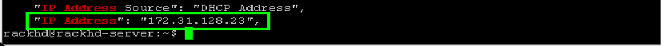
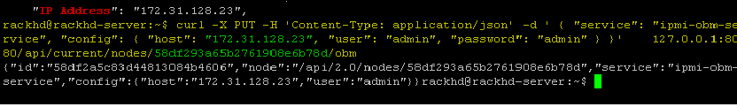

Automatic Discovery and Catalog Server Nodes
===============================================

In this module, you will learn about RackHD's discovery, catalog and poller functionality by using
the simulated nodes that were set up in the previous modules.

- Discovery: RackHD can automatically discover a node that attempts to do PXE boot on the network that RackHD is monitoring.

- Catalog: RackHD can capture the nodes' attributes and capabilities.

- Poller: RackHD can periodically capture nodes' telemetry data from the hardware interfaces.

Database Cleanup Overview
----------------------------------

When a node attempts to do PXE boot on the network managed by RackHD, RackHD responds to
the PXE boot. If RackHD is not aware of the server, RackHD responds with microkernel images that
catalogs the node and records it with RackHD. If the node is already discovered (if a node's MAC
is recorded in RackHD's database), this node will not PXE boot the RackHD microkernel again.

The node will fail the PXE boot and move on to a hard disk boot.
In the previous modules, the "sudo infrasim node start" command already brought up the virtual
servers, and the virtual nodes are already discovered by RackHD. In this module, you will stop
RackHD and clean up the database so RackHD is forced to discover those nodes again.

``[Note]`` Before the following operations are excuted, you need to ssh the vagrant box first. ``vagrant ssh dev`` can enter the demo environment. ``vagrant ssh dev_ansible`` can enter development environment.

Clean up The Database
~~~~~~~~~~~~~~~~~~~~~

RackHD uses a Mongo database for storing static data such as catalog information or workflow states.

**1. For Development Environment**

- stop rackhd
 
.. code::

   vagrant@rackhd:~$ sudo su
   root@rackhd:/home/vagrant# pm2 stop /home/vagrant/rackhd-pm2-config.yml

- Clean database by typing the following command

.. code::
    
   root@rackhd:/home/vagrant# mongo pxe

- When the ">" prompt appears, type the following command

.. code::
 
   > db.dropDatabase()

- Press Ctrl+D to exit. Mongo will display 'bye', and then exit. The running process of the development environment is shown in the following graph.

**2. For Demo Environment**

- stop rackhd
.. code::

    vagrant@rackhd:~$ sudo service rackhd stop

- Clean database by typing the following command

.. code::

   vagrant@rackhd:~$ mongo pxe

- When the ">" prompt appears, type the following command

.. code::

   > db.dropDatabase()

- Press Ctrl+D to exit. Mongo will display ‘bye’, and then exit

Restart RackHD
~~~~~~~~~~~~~~

**1. For Development Environment**

- Start RackHD again by typing the following command.

.. code::

    vagrant@rackhd:~$ sudo su
    root@rackhd:/home/vagrant# pm2 start /home/vagrant/rackhd-pm2-config.yml

- To use RackHD conveniently, the auth function of RackHD can be closed. Just edit ``/opt/monorail/config.json``, set `"authEnabled": true` of the first element of `httpEndpoints` to `"authEnabled": false`. Then restart RackHD service.

.. code::

    root@rackhd:/home/vagrant# pm2 restart /home/vagrant/rackhd-pm2-config.yml

-  Wait several seconds, and then type the following RackHD restful API to ensure RackHD is started and is running successfully.

.. code::

    root@rackhd:/home/vagrant# curl localhost:8080/api/2.0/nodes

-  The following message appears when RackHD is booting and not ready. The process takes several seconds. You can retry after 10 seconds.

.. code::

  curl: (7) Failed to connect to localhost port 8080: Connection refused

-  When the API returns "[]"(no nodes discovered so far) RackHD software stacks are running successfully.
 
**2. For Demo Environment**

- Start RackHD again by typing the following command.

.. code::
  
    vagrant@rackhd:~$ sudo service rackhd start

- To use RackHD conveniently, the auth function of RackHD can be closed. Just edit ``/opt/monorail/config.json``, set `"authEnabled": true` of the first element of `httpEndpoints` to `"authEnabled": false`. Then restart RackHD service.

.. code::

   vagrant@rackhd:~$ sudo service rackhd restart

-  Wait several seconds, and then type the following RackHD restful API to ensure RackHD is started and is running successfully.

.. code::

    vagrant@rackhd:~$ curl localhost:8080/api/2.0/nodes

-  The following message appears when RackHD is booting and not ready. The process takes several seconds. You can retry after 10 seconds.

.. code::

  curl: (7) Failed to connect to localhost port 8080: Connection refused

-  When the API returns "[]"(no nodes discovered so far) RackHD software stacks are running successfully.

Discovery
----------
Vnode is used to be discovered. A vnode is defined in the file ``Vagrantfile``. The infrasim/quanta_d52 base box is used to set up a vnode. If you want to learn more about InfraSIM, you can go to https://github.com/InfraSIM. UltraVNC Viewer is used to show the console of vnode. In this environment, vnode console will be forwarded to host network port `15901`.

1. set up a vnode

``[Note]`` You need to execute below command in the dirctory which contains ``Vagantfile`` on host.If you are in vagrant box, you need to execute ``exit`` command to exit box and then execute below command. 

.. code::
  
  sudo vagrant up quanta_d51

You can execute command on host to check whether quanta_d51 vnode is up successfully. If the status of quanta_d51 vnode is ``running``, quanta_d51 is up successfully.

.. code::

  sudo vagrant status

If you are interested in quanta_d51 vnode, you can execute the below command on host to login in quanta_d51 vnode with password: **root**. Then execute the command ``exit`` to enter host.

.. code::

  sudo vagrant ssh quanta_d51

2. On the Windows desktop, double-click the UltraVNC Viewer, and connect to <IP>:15901,to view the PXE progress to boot the microkernel. The <IP> should be set to the node ip where ``quanta_d51 vnode`` is set up by using command **"Vagrant up quanta_d51"**. For example, If you set up environmet on windows, you just need to set <IP> to ``localhost``. If you set up environment on Linux, you just need to get IP by ``ifconfig eth0`` and then replace <IP>.

3. The vNode console pauses for about 1 minute, to catalog the vnode information.The vNode will reboot after cataloging finishes. This reboot indicates that the discovery workflow is completed.

4.Retrieve the nodes by typing the following RackHD API to discover the node.

.. code::
   
   vagrant@rackhd:~$ curl localhost:8080/api/2.0/nodes | jq '.'

You can see one or more vnodes whose type is "enclosure" or "compute".

.. image:: ../_static/curl_nodes_info.png
    :align: center

NodeId
-------

NodeId is the unique Identity of a node in RackHD. List all the compute type nodes being discovered on the rackhd-server SSH console by typing the following command. Append "?type=compute" as a query string.

You will focus on compute type nodes in this module

.. code::

  vagrant@rackhd:~$ curl 127.0.0.1:8080/api/2.0/nodes?type=compute | jq '.'

In the following json output, the compute node ID is ``58b660116d20657f0c5d6466``. You will take it as a variable named <node_id> in the following module.

**Note**: The node_id varies for different nodes. Even for the same node, the Node ID changes if the RackHD database is being cleaned and the node rediscovered.

Do not use the example ``58b660116d20657f0c5d6466`` in your vLab. Use the displayed Node ID in your lab.

Retrieve Catalogs
-----------------

Catalogs are described as the following:

- Free form data structures with information about the nodes
- Pluggable mechanisms for adding new catalogers for additional data
- JSON documents stored in MongoDB

Examples of catalog sources include the following:

- Drive smart information
- DriveId catalog including system identified drive information
- DMI from `dmidecode` command
- OHAI aggregate of different stats in more friendly JSON format
- IPMI information gets per ipmitool over KCS channel LAN information
- FRU, SEL, SDR, MC information
- `lsscsi`, `lspci`, `lshw` commands output
- Raid information can be got via storcli/perccli tool
- Dell computers provide some catalogs retrieved from RACADM tool
- LLDP

**Specify The Catalogs Source**

1. To view the sources where the catalogs data was retrieved from, type the following command.

**Note**: the <node_id> is the Node-ID retrieved from Step 3.

.. code::
   
    vagrant@rackhd:~$ curl 127.0.0.1:8080/api/2.0/nodes/<node_id>/catalogs/ | jq '.' | grep source

.. image:: ../_static/catalog_info.png
     :align: center

2. Select one of the sources you are interested in, and then append to the command. For example, the following example use ipmi-fru

.. code::

   vagrant@rackhd:~$ curl 127.0.0.1:8080/api/2.0/nodes/<node_id>/catalogs/ipmi-fru | jq '.'

or "driveId" as example

.. code::

   vagrant@rackhd:~$ curl 127.0.0.1:8080/api/2.0/nodes/<node_id>/catalogs/driveId | jq '.'

Retrieve Pollers
------------------------

What's Poller
~~~~~~~~~~~~~

- The pollers API provides functionality for periodic collection of IPMI and SNMP data. 
- IPMI Pollers can be standalone or can be associated with a node. When an IPMI poller is associated with a node, it will attempt to use that node’s IPMI OBM settings in order to communicate with the BMC. Otherwise, the poller must be manually configured with that node’s IPMI settings.
- SNMP pollers can be standalone or associated with a node. When an SNMP poller is associated with a node, it attempts to use that node’s snmpSettings in order to communicate via SNMP. Otherwise, the poller must be manually configured with that node’s SNMP settings.

Examples of Telemetry
~~~~~~~~~~~~~~~~~~~~~

- Switches Switch CPU, Memory
- Port status
- Port utilization
- Arbitrary MIB gathering capable
- PDU Socket status
- Arbitrary MIB gathering capable
- IPMI Sensors (SDR)
- Power status

Set the OBM Setting
~~~~~~~~~~~~~~~~~~~~

Before you set up the poller, you must set the OBM Setting. BMC on servers is a typical Out-of-Band-Management (OBM) interface.

To talk with BMC, RackHD must be configured with the the BMC IP and credentials. You must bind them with a <node_id>, so that IPMI communication between the node and RackHD can be established. In RackHD refers to this as the OBM Setting.

1. For a <node_id>, retrieve the BMC IP address, from the catalogs among "bmc" source, by running the following command on rackhd-server.

.. code::

**Note**: the <node_id> is the Node-ID retrieved from Step 3.

.. code::

   vagrant@rackhd:~$ curl localhost:8080/api/2.0/nodes/<node_id>/catalogs/bmc | jq '.' | grep "IP Address"

2. In the following example, the BMC IP is 172.31.128.23. and it will be the value of <BMC_IP> variable in next step.

.. code::

3. Include the BMC IP (it should be 172.31.128.xx , the DHCP from rackhd-server) in the following command, to set an IPMI OBM setting on a node.

**Note**: Do not forget to fill the exact <BMC_IP> and <node_id> based on those assigned to your specific nodes. The OBM setting would be returned as response if the command is executed successfully.

.. code::

   vagrant@rackhd:~$ curl -k -X PUT -H 'Content-Type: application/json' -d '{ "nodeId": "<node-id>", "service": "ipmi-obm-service", "config": { "user": "admin", "password": "admin", "host": "<BMC-IP>" } }' localhost:8080/api/2.0/obms

4. Once the OBM credentials have been configured, RackHD can communicate with BMC in workflows (e.g. power-cycle the BMC or retrieve poller data)

Retrieve Pollers
~~~~~~~~~~~~~~~~~

1. On rackhd-server,list the active pollers which by default run in the background, by typing the following command.

.. code::

  vagrant@rackhd:~$ curl 127.0.0.1:8080/api/2.0/pollers| jq '.'

Below is a definition of each field in the example output below:

- "id" is the poller's id. Denote it as <poller_id>. you will refer to later.
- "type" means it is an IPMI poller or SNMP poller, and so on.
- "pollInternal" is the interval for the frequency that RackHD polls that data. The time is the milliseconds to wait between polls.
- "node" is the target node of the poller that the data comes from.
- "command" is the kind of IPMI command that this poller is issued.

Note: Record listed below is an example. The output on your screen will look similar with different
data.

.. code::

 {
  "id": "58b66105a36ced790cd01091",
  "type": "ipmi",
  "pollInterval": 30000,
  "node": "/api/2.0/nodes/58b660116d20657f0c5d6466",
  "config": {
  "command": "sdr"
  },
  "lastStarted": "2017-03-01T06:22:35.417Z",
  "lastFinished": "2017-03-01T06:22:55.241Z",
  "paused": false,
  "failureCount": 0
 }

2. Show the poller data, by typing the following command.

.. code::
 
  vagrant@rackhd:~$ curl 127.0.0.1:8080/api/2.0/pollers/<poller_id>/data | jq '.' 

3. Change the interval of a poller, by typing the following command.

.. code::

 vagrant@rackhd:~$ curl -X PATCH -H 'Content-Type: application/json' -d '{"pollInterval":15000}' 127.0.0.1:8080/api/2.0/pollers/<poller_id>

.. image:: ../_static/pollers_info.png
     :align: center

