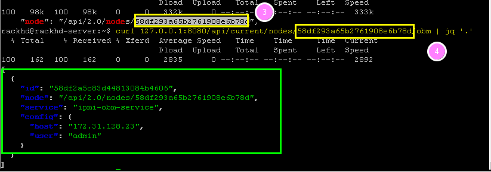
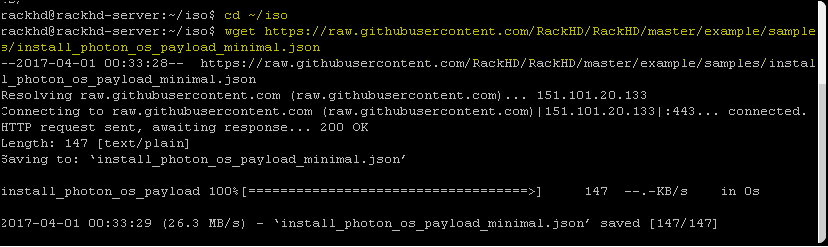
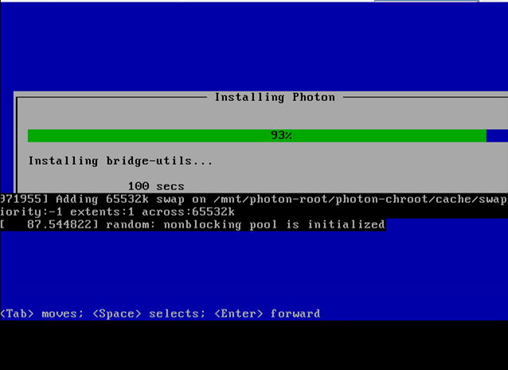

Perform an Unattended OS Install
=================================

Overview
------------

In this section, you will leverage RackHD to perform an unattended OS install onto a bare metal server.

In this section, the Photon OS is used as the example. It is a minimal Linux container host, optimized to run on VMware platforms. Photon was chosen because it is small enough for the OS installation to take approximately 8 or 9 minutes. The same process that is used in this lab can be used to install other mainstream operating systems, such as Ubuntu, CentOS, and ESXi, which take longer to install.

Install OS
-----------------
Before the following operations are excuted, you need to ssh the vagrant box first. ``vagrant ssh dev`` can enter the demo environment. ``vagrant ssh dev_ansible`` can enter development environment.

Prerequisite
~~~~~~~~~~~~~

1. The quanta_d51 vnode which runs in vagrant is used as the OS-Install target node in this Lab. Get the information of vnode.

.. code::

  vagrant@rackhd:~$ curl http://localhost:8080/api/2.0/catalogs | jq '.' | grep D51 -B8 | grep node

2. Use the mouse to select and copy ``node-id`` text( as shown in the below example snapshot). This ID will be used in the following steps.

3. In RackHD server, ensure its OBM setting is not blank. right click to paste the ``node-id`` text in the following command.

.. code::

  vagrant@rackhd:~$ curl 127.0.0.1:8080/api/2.0/nodes/<node-id>/obm

In the following example, in the green block, the OBM is configured with the user name of admin.

If the response comes back as [ ], complete the Set the OBM Setting section in 7.2, to set the OBM setting.

Set Up OS Mirror
~~~~~~~~~~~~~~~~

To install OS on the vnode, RackHD can act as an OS mirror repository.

1. Create the following folders

For development environment,

.. code::

    vagrant@rackhd:~$ sudo su
    root@rackhd:/home/vagrant# mkdir iso && cd iso
    root@rackhd:/home/vagrant# mkdir -p /var/mirrors/Photon
    root@rackhd:/home/vagrant# mkdir -p /home/vagrant/src/on-http/static/http/mirrors/

For demo environment,

.. code::

     vagrant@rackhd:~$ sudo su
     root@rackhd:/home/vagrant# mkdir iso && cd iso
     root@rackhd:/home/vagrant# mkdir -p /var/mirrors/Photon
     root@rackhd:/home/vagrant# mkdir -p /var/renasar/on-http/static/http/mirrors/

2. Create OS mirror from an ISO image by typing below command. (Note:The photon-1.0-13c08b6.iso needs to be downloaded in /home/vagrant/iso. Search the download URL, download it with `wget` command. For example: `wget https://bintray.com/vmware/photon/download_file?file_path=photon-1.0-62c543d.iso`)

.. code::

   root@rackhd:/home/vagrant/iso# sudo mount -o loop photon-1.0-13c08b6.iso /var/mirrors/Photon

3. Set up a Photon OS install mirror under/var/mirrors/Photon.

For development environment,

.. code::

   root@rackhd:/home/vagrant/iso# sudo ln -s /var/mirrors/Photon /home/vagrant/src/on-http/static/http/mirrors/

For demo environment,

.. code::

   root@rackhd:/home/vagrant/iso# sudo ln -s /var/mirrors/Photon /var/renasar/on-http/static/http/mirrors/

Install OS with RackHD API
~~~~~~~~~~~~~~~~~~~~~~~~~~

In this step, you will create a payload file, and then leverage the RackHD build-in workflow to install and OS on the vNode.

1. Download the Photon OS install payload example by running the following command. For more payload examples, see example of other OS.

.. code::

   root@rackhd:/home/vagrant/iso# wget https://raw.githubusercontent.com/RackHD/RackHD/master/example/samples/install_photon_os_payload_minimal.json

2. Modify the payload json file by using vim.

(2.1) Open file with vim, by typing the following command.

.. code::

   root@rackhd:/home/vagrant/iso# vim install_photon_os_payload_minimal.json

(2.2) Change the "repo" line to below then save .

.. code::

  "repo": "http://172.31.128.1:9080/mirrors/Photon"

`Note: Notice the case issue, avoid the mismatch between repo address and the name of mirror folder.`

(2.3) Save and exist vim ( Hit "ESC" key first, then type ":wq" , then hit "Enter")

Install the OS by using built-in "Graph.InstallPhotonOS" workflow and the ``<node-ID>`` that you obtained in the Prerequisites at the beginning of this lab. Run the following command

.. code::

  root@rackhd:/home/vagrant# curl -X POST -H 'Content-Type: application/json' -d @install_photon_os_payload_minimal.json 127.0.0.1:8080/api/2.0/nodes/<node-ID>/workflows?name=Graph.InstallPhotonOS | jq '.'

Installation Progress
~~~~~~~~~~~~~~~~~~~~~

1. Run the following API to monitor a workflow that is running.

.. code::

  root@rackhd:/home/vagrant# curl 127.0.0.1:8080/api/2.0/nodes/<Node_ID>/workflows?active=true | jq '.'

In the json output RackHD responses, you will see "_status" field is "running", and "graphName" field is "Install Photon OS",

`Note: If the "[]" is returned, the workflow failed immediately. The failure is likely because the OBM setting is not set. (No OBM service assigned to this node.)`

2. Use UltraVNC to monitor the corresponding vNode's console.

3. It will PXE boot from the Photon OS install image, then after 5 mins, it will show blue progress screen as below. The entire Photon OS installation will take ~9 mins.

You can move on the guide or revisit previous sessions, then go back after 4~5 minutes .

