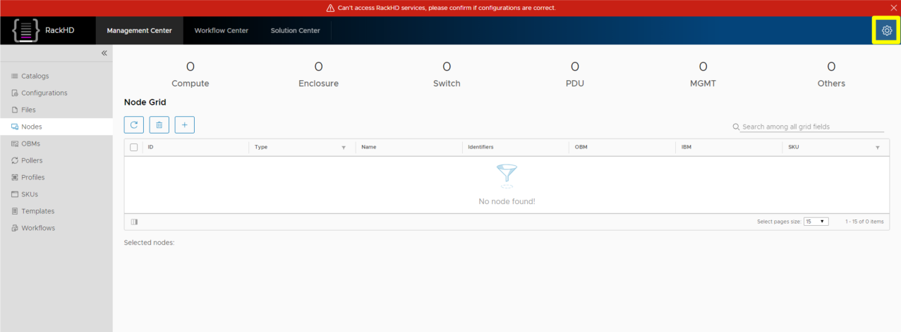
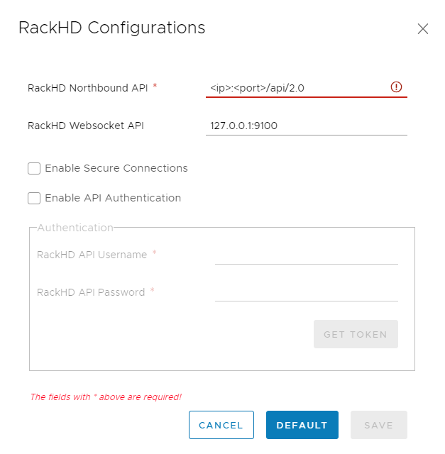
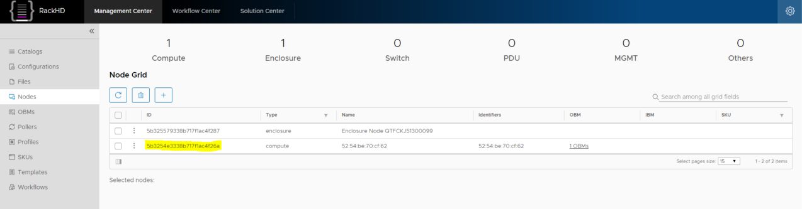

on-web-ui 2.0
=============================

.. contents:: Table of Contents

.. _RackHD Web UI: http://rackhd.github.io/on-web-ui

You can `download`_ a zip of the latest version.

.. _download: https://github.com/RackHD/on-web-ui/archive/gh-pages-2.0.zip

This zip file can be extracted inside "on-http/static/http" to serve the UI from the MonoRail API server.

Source code for the web user interface is available at https://github.com/RackHD/on-web-ui.
There is also a `README`_ for learning how to about UI development.

.. _README: https://github.com/RackHD/on-web-ui/blob/master/README.md

How to Configure API Endpoint Settings
---------------------------------------

* Open web browser, and then go to the following URL ``http://<ip>:<port>/ui``, replace with your own ipaddr and port.
* Click the ``gear`` button on the top right panel

* Enter your ``RackHD Northbound API``, then click ``save`` button, if your ip address is invalid, it will warn you ``RackHD northbound API is inaccessible``. In addition, we support secure connection ``https`` and ``API Authentication``, you can check these options in the configuration panel if you want.

* Then you will see all discovered nodes in the panel.

